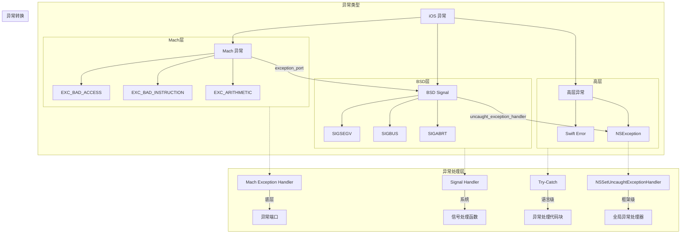
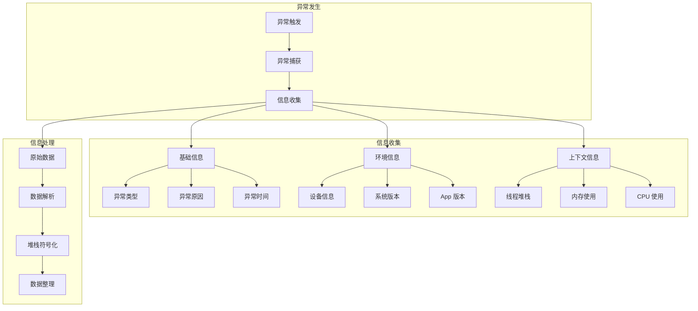
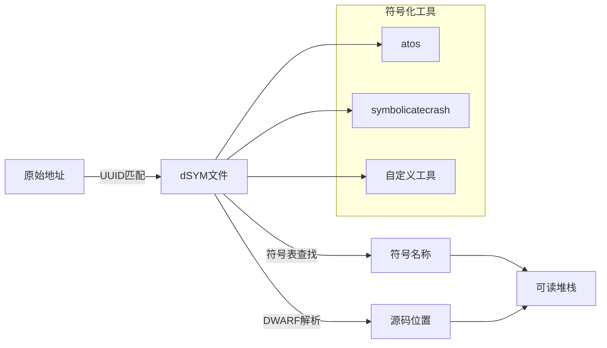
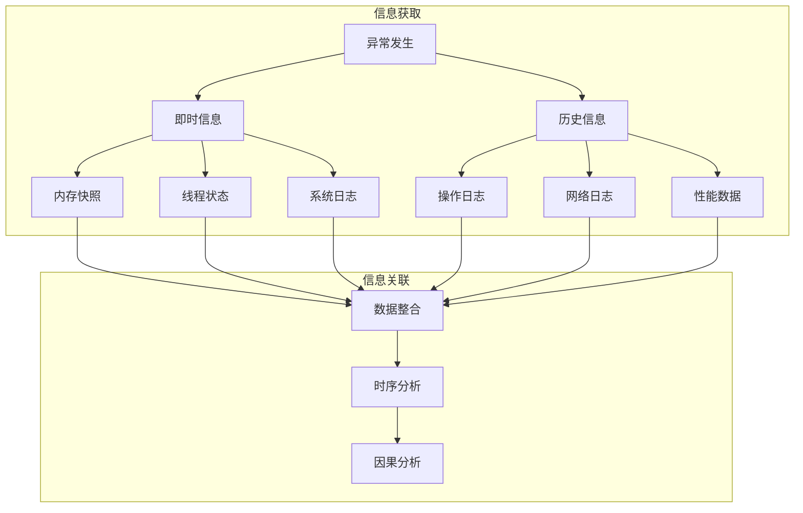

# iOS 异常捕获原理

## 1. iOS 异常基础

在 iOS 中，异常（Exception）是指程序运行过程中出现的非正常情况，这种情况下应用无法再正常继续执行下去了，也就是我们常说的应用崩了。

异常有好几种，按照从底层到上层的顺序来说的话，依次是：

Mach 异常是由操作系统内核引发的，常见的比如访问了无效内存地址、除零错误等，它是一种底层的异常机制。

BSD Signal 异常是 Mach 异常在 BSD 层的一种表现形式，通常是由 Mach 异常转换而来的，常见的比如SIGSEGV（段错误）、SIGBUS（总线错误）、SIGABRT（异常终止）等。

Objective-C 异常（NSException）是一种高层的异常机制，用于处理运行时的异常情况。而 Swift Error 则是一种错误处理机制，主要用于处理可恢复的错误，它不是真正意义上的异常机制。

## 2. iOS 异常捕获机制

### Mach 异常

Mach 异常首先通过异常端口（exception_port）转换为对应的 BSD Signal。

| Mach 异常类型 | BSD Signal | 说明 |
|--------------|------------|------|
| EXC_BAD_ACCESS | SIGSEGV/SIGBUS | 内存访问错误，具体信号取决于访问错误类型 |
| EXC_BAD_INSTRUCTION | SIGILL | 非法指令错误 |
| EXC_ARITHMETIC | SIGFPE | 算术运算错误 |
| EXC_BREAKPOINT | SIGTRAP | 断点异常 |
| EXC_SOFTWARE | SIGABRT | 软件触发的异常 |
| EXC_GUARD | SIGSYS | 系统调用错误 |

有一些 Mach 异常无法直接转换为 BSD Signal，只能在 Mach 层面被处理，比如：

| Mach 异常类型 | 说明 |
|--------------|------|
| EXC_RESOURCE | 资源限制相关的异常，Mach 层特有 |
| EXC_GUARD | 文件系统保护相关的异常，Mach 层特有 |
| EXC_CORPSE_NOTIFY | 进程死亡通知相关的异常，Mach 层特有 |

这种情况下，系统提供了一个底层的异常处理机制，即 Mach Exception Handler。

1. 通过 task_get_exception_ports 获取当前任务的异常端口
2. 使用 task_set_exception_ports 设置异常处理端口：

```
kern_return_t task_set_exception_ports(
    task_t task,
    exception_mask_t exception_mask,
    mach_port_t exception_port,
    exception_behavior_t behavior,
    thread_state_flavor_t flavor
);
```
3. 在异常处理端口中实现异常处理逻辑：
- 获取异常信息（异常类型、出错地址等）
- 获取线程状态信息
- 记录崩溃现场信息
- 进行必要的资源清理

Mach 异常处理是最底层的异常处理机制，它具有最高的处理优先级。当发生异常时，系统会优先调用 Mach 异常处理器，如果异常没有被处理，才会转换为 BSD Signal。由于实现较为复杂，在实际开发中通常使用更上层的异常处理机制，如 BSD Signal 或 NSException。不过在一些需要深度防护的场景下，Mach 异常处理器仍然是不可或缺的工具。

### BSD Signal
BSD Signal 可以通过 signal_handler() 来注册对应的信号处理器。当发生对应的信号时，系统会调用该信号处理器进行处理。

```objc
#include <signal.h>

// 信号处理函数
void SignalHandler(int signal) {
    // 根据不同信号类型进行处理
    switch (signal) {
        case SIGSEGV:
            break;
        case SIGBUS:
            break;
        case SIGABRT:
            break;
        case SIGILL:
            break;
        case SIGFPE:
            break;
        default:
            break;
    }
    
    // 获取当前线程的调用栈
    NSString *callStack = [NSThread callStackSymbols].description;
    NSLog(@"调用栈信息:\n%@", callStack);
    
    // 结束程序
    exit(signal);
}

// 注册信号处理器
void RegisterSignalHandler(void) {
    // 注册需要捕获的信号
    signal(SIGSEGV, SignalHandler);
    signal(SIGBUS, SignalHandler);
    signal(SIGABRT, SignalHandler);
    signal(SIGILL, SignalHandler);
    signal(SIGFPE, SignalHandler);
}
```

需要注意的是，BSD Signal 和 NSException 是两个独立的异常处理机制，Signal 不会自动转换为 NSException。当发生底层异常时，会先触发 Mach 异常处理器，如果没有处理则会转换为对应的 Signal 处理。

### 高层处理

#### Objective-C 异常处理
Objective-C 提供了 @try-@catch-@finally 语法来处理异常：

```objc
@try {
    // 可能抛出异常的代码
    NSArray *array = @[];
    id obj = array[1]; // 会抛出越界异常
} @catch (NSException *exception) {
    // 异常处理代码
    NSLog(@"捕获到异常：%@", exception);
    NSLog(@"异常名称：%@", exception.name);
    NSLog(@"异常原因：%@", exception.reason);
    NSLog(@"异常调用栈：%@", exception.callStackSymbols);
} @finally {
    // 无论是否发生异常都会执行的代码
    NSLog(@"清理工作");
}
```

同时，我们可以使用 NSSetUncaughtExceptionHandler 注册一个全局的异常处理器，用于捕获未被 @try-@catch 捕获的异常：

```objc
static void UncaughtExceptionHandler(NSException *exception) {
    // 获取异常信息
    NSString *name = [exception name];
    NSString *reason = [exception reason];
    NSArray *symbols = [exception callStackSymbols];
    
    // 异常处理逻辑
    NSString *exceptionInfo = [NSString stringWithFormat:
        @"异常名称：%@\n异常原因：%@\n异常堆栈：%@",
        name, reason, symbols];
    
    // 可以在这里将异常信息写入文件或上报服务器
    NSLog(@"%@", exceptionInfo);
}

// 在程序启动时注册异常处理器
NSSetUncaughtExceptionHandler(&UncaughtExceptionHandler);
```

#### Swift 错误处理

Swift 使用 Error 协议来表示错误，并提供了 do-catch 语法来处理错误：

```swift
// 定义错误类型
enum NetworkError: Error {
    case badURL
    case noData
    case parseError
}

// 可能抛出错误的函数
func fetchData(from urlString: String) throws -> Data {
    guard let url = URL(string: urlString) else {
        throw NetworkError.badURL
    }
    
    // 模拟网络请求
    guard let data = try? Data(contentsOf: url) else {
        throw NetworkError.noData
    }
    
    return data
}

// 使用 do-catch 处理错误
do {
    let data = try fetchData(from: "https://api.example.com")
    // 处理数据
} catch NetworkError.badURL {
    print("无效的 URL")
} catch NetworkError.noData {
    print("没有数据")
} catch {
    print("其他错误：\(error)")
}
```

下图展示了 iOS 中异常处理的完整流程。



## 3. 异常信息的处理和分析

异常信息的收集和处理是崩溃分析的基础。当应用发生异常时，系统会立即启动一系列信息收集机制，以捕获和记录异常发生时的完整现场信息。这个过程包括异常的捕获、信息的收集以及后续的数据处理。



### 3.1 关键信息的提取

在异常捕获的第一时间，系统会自动收集一系列关键信息。首先是异常的基础特征，包括异常的具体类型（可能是 Mach 异常、Signal 信号或 NSException），导致异常的具体原因（如错误码和描述信息），以及异常发生的确切时间点和涉及的线程信息。这些信息能够帮助我们快速定位异常的性质和严重程度。

与此同时，系统还会记录异常发生时的环境上下文。这包括设备的具体型号、当前运行的 iOS 系统版本，以及应用程序的版本号和构建信息。设备的基本状态，比如是否越狱，也是重要的环境信息之一。这些信息有助于我们了解异常是否与特定的硬件环境或系统版本相关。

更深层次的信息收集则关注于程序运行时的状态。系统会记录发生异常时的完整线程调用栈，这是定位问题最直接的线索。同时，内存使用情况和 CPU 占用率等性能指标，以及相关的系统日志，都是构成完整异常分析的重要组成部分。这些运行时信息能够帮助开发者理解异常发生时的程序运行状态，从而更准确地定位和解决问题。

### 3.2 堆栈符号化

#### 基本概念

堆栈符号化是将程序崩溃时的内存地址转换为具有可读性的函数名、文件名和行号的过程。这个过程对于理解崩溃原因至关重要。

在 iOS 应用发生崩溃时，系统会记录崩溃时的内存地址，形如：

```
0x000000010023A4C8 -[MyClass myMethod] + 88
0x000000010023B6E4 -[MyClass otherMethod] + 156
```

这些地址信息对开发者来说难以理解，需要通过符号化转换为：

```
-[MyClass myMethod] (MyClass.m:42)
-[MyClass otherMethod] (MyClass.m:78)
```

#### 实现原理

##### dSYM 文件结构

dSYM（Debug Symbol File）文件是符号化过程的核心，它包含了将内存地址映射到源代码位置所需的所有信息：

1. **符号表（Symbol Table）**
   - 记录了所有符号（函数名、变量名等）的地址映射
   - 包含符号的名称、地址范围、类型等信息

2. **调试信息（Debug Info）**
   - DWARF 格式的调试信息
   - 包含源代码文件名、行号等位置信息
   - 记录了编译时的类型信息和变量作用域

##### 符号化流程

符号化过程主要包含以下步骤：

1. **地址解析**
   - 从崩溃日志中提取内存地址
   - 确定地址所属的二进制文件

2. **符号查找**
   - 在 dSYM 文件中查找对应的符号表
   - 根据地址范围定位具体符号

3. **调试信息解析**
   - 解析 DWARF 格式的调试信息
   - 获取源代码文件名和行号

4. **信息整合**
   - 组合符号名称、文件名和行号
   - 生成可读的堆栈信息



### 3.3 上下文信息的获取

崩溃发生时，系统会收集多个维度的运行环境信息，帮助我们更好地定位问题。

内存方面，主要包括应用内存使用量、系统可用内存、内存警告记录等。这些信息可以快速判断崩溃是否由内存问题引起，比如内存泄漏或内存压力过大。

线程方面，系统会记录所有线程的运行状态、优先级和依赖关系。这对于发现死锁、线程竞争等并发问题很有帮助，也能让我们理解崩溃时的执行流程。

系统层面，会记录当前的系统负载、关键日志以及其他进程的运行状态。这些信息有助于判断是否是系统资源紧张或后台进程异常导致的崩溃。

用户行为的追踪也是问题定位的重要线索。系统会记录崩溃发生前的用户操作路径、关键的行为日志，以及相关的网络请求记录。这些信息能够帮助开发者重现问题场景，理解用户的实际使用情况。



通过系统化地收集和关联这些信息，开发团队能够准确定位崩溃发生的具体环境和触发条件，有效地复现问题场景，深入分析崩溃的根本原因，最终制定出精准的修复方案。这种全面的信息收集和分析机制，是保证应用稳定性的重要基础。

## 总结

本篇文章介绍了 iOS 异常的分类以及捕获的原理。接下来的[几篇文章](./kscrash_monitor.md)里我们将逐步介绍 iOS上一个知名的异常监控 KSCrash 是如何实现的。


