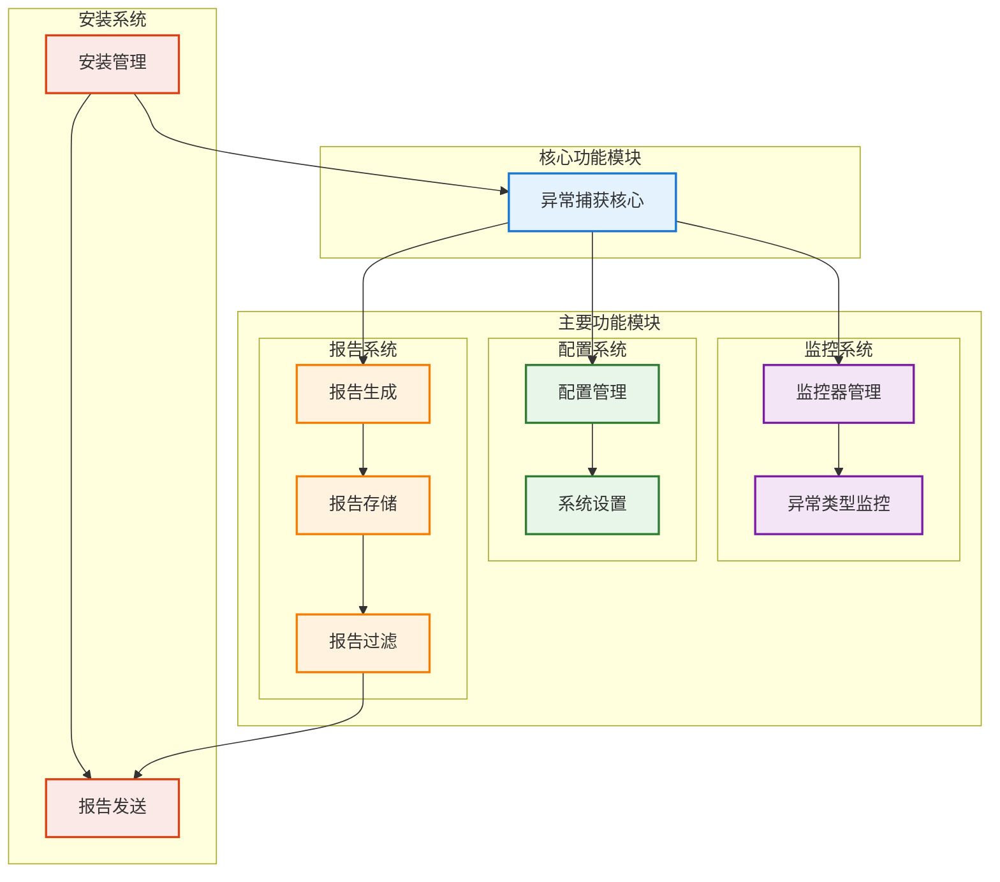
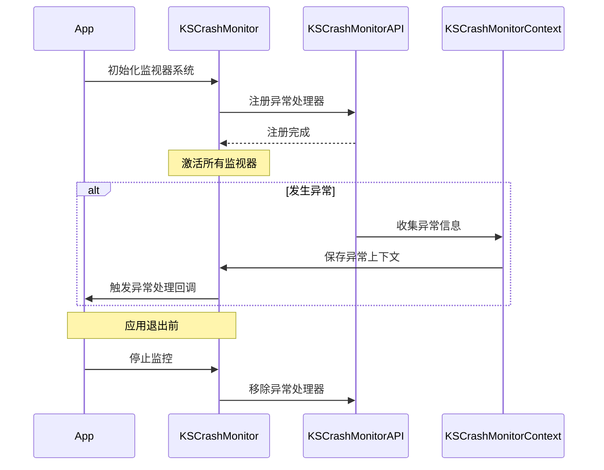
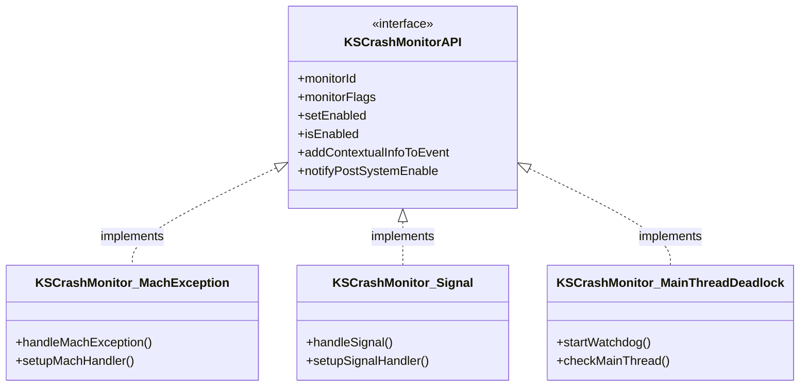
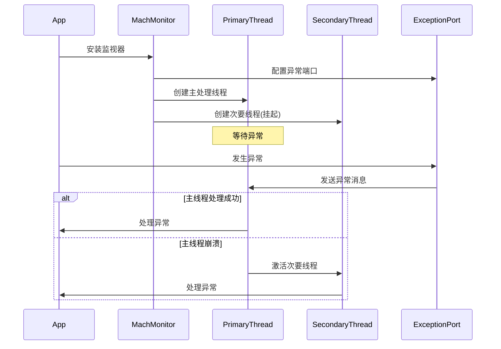
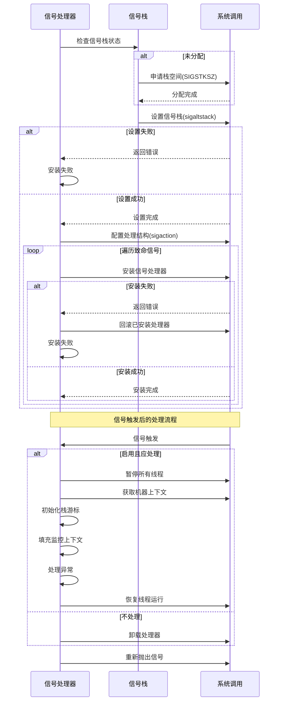
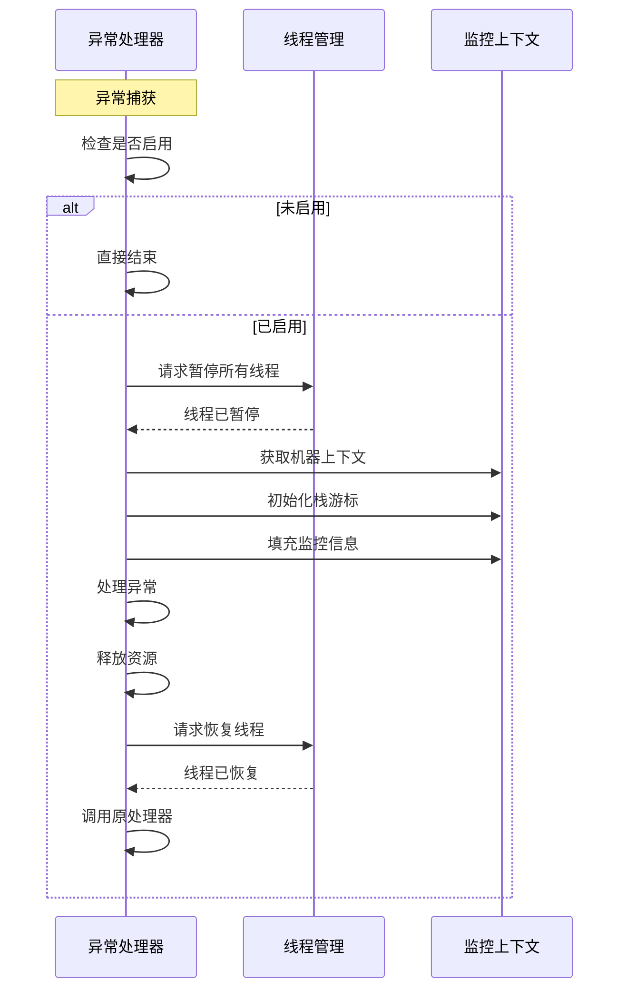
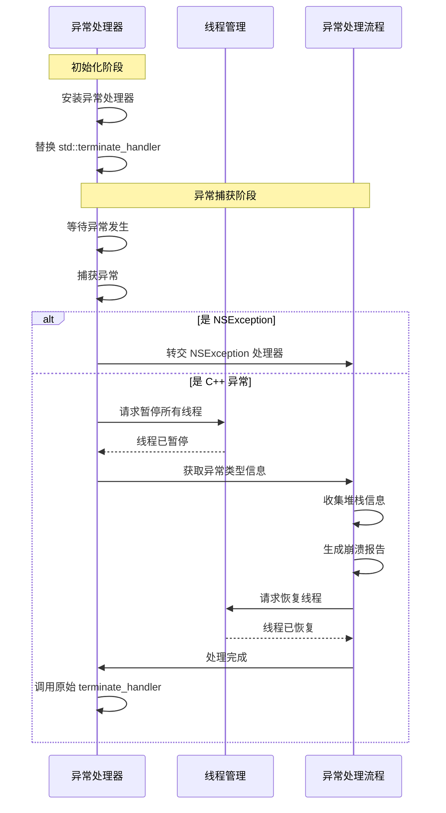
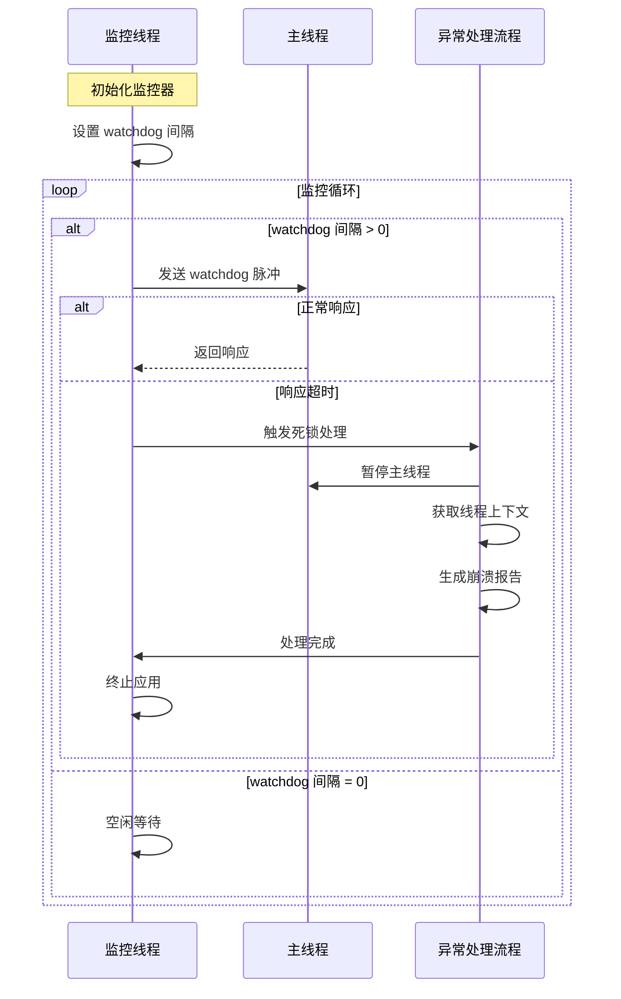
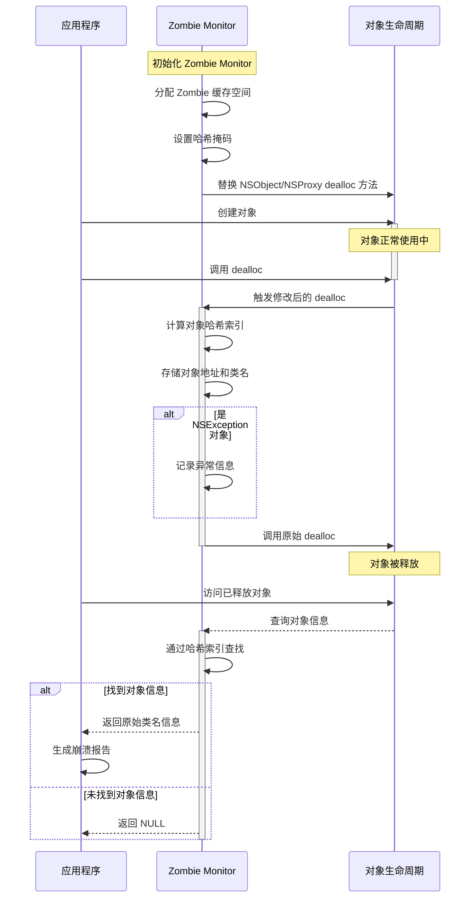

# KSCrash 实现原理 - 监控系统实现
在了解了 iOS 异常的分类和捕获原理后，我们继续深入探讨 [KSCrash](https://github.com/kstenerud/KSCrash) 这个优秀的异常监控框架的实现原理。KSCrash 作为一个功能丰富的异常监控方案，其实现涉及多个复杂的技术模块。本文将重点为你解析 KSCrash 的整体架构，并深入剖析其核心监控系统的实现细节。至于其他功能模块的实现，我们会在后续文章中逐一展开。


## 框架设计



KSCrash 的整体架构清晰而模块化，主要包含五个核心部分：

1. **核心功能模块**：作为整个框架的中枢，协调各个模块的工作，并实现异常捕获的核心逻辑
2. **监控系统**：负责管理和协调各类异常监控器，确保能够全面捕获不同类型的异常
3. **配置系统**：提供灵活的配置选项，让开发者能够根据需求自定义框架的行为
4. **报告系统**：负责异常发生后的数据处理，包括生成详细的崩溃报告，进行本地存储和数据过滤
5. **安装系统**：处理框架的安装流程，并负责崩溃报告的发送工作

## 工作流程


## 监控系统

KSCrash 在监控系统的设计上采用了高度模块化的思路。每个监控器都专注于处理特定类型的异常，并通过统一的接口规范和灵活的注册机制实现。这种设计不仅让系统更容易维护和扩展，也为开发者提供了根据实际需求自由组合监控器的能力。

###  监视器接口


KSCrash 提供了 9 种预设的监视器。
```
typedef enum {
    KSCrashMonitorTypeNone               = 0,
    KSCrashMonitorTypeMachException      = 1 << 0,  // Mach 内核异常
    KSCrashMonitorTypeSignal             = 1 << 1,  // 致命信号
    KSCrashMonitorTypeCPPException       = 1 << 2,  // C++ 异常
    KSCrashMonitorTypeNSException        = 1 << 3,  // Objective-C NSException
    KSCrashMonitorTypeMainThreadDeadlock = 1 << 4,  // 主线程死锁
    KSCrashMonitorTypeUserReported       = 1 << 5,  // 用户报告的异常
    KSCrashMonitorTypeSystem             = 1 << 6,  // 系统信息
    KSCrashMonitorTypeApplicationState   = 1 << 7,  // 应用状态
    KSCrashMonitorTypeZombie             = 1 << 8,  // 僵尸对象
    KSCrashMonitorTypeMemoryTermination  = 1 << 9,  // 内存终止
} KSCrashMonitorType;
```

### 监视器管理

1. 初始化监视器列表：
```c
static void initializeMonitorList(MonitorList *list)
{
    list->count = 0;
    list->capacity = INITIAL_MONITOR_CAPACITY;
    list->apis = (KSCrashMonitorAPI **)malloc(list->capacity * sizeof(KSCrashMonitorAPI *));
}
```

2. 添加监视器：
```c
static void addMonitor(MonitorList *list, KSCrashMonitorAPI *api)
{
    if (list->count >= list->capacity) {
        list->capacity *= 2;
        list->apis = (KSCrashMonitorAPI **)realloc(list->apis, list->capacity * sizeof(KSCrashMonitorAPI *));
    }
    list->apis[list->count++] = api;
}
```

3. 激活监视器：
```c
bool kscm_activateMonitors(void)
{
    bool isDebuggerUnsafe = ksdebug_isBeingTraced();
    bool isAsyncSafeRequired = g_requiresAsyncSafety;

    // 根据环境条件启用或禁用监视器
    for (size_t i = 0; i < g_monitors.count; i++) {
        KSCrashMonitorAPI *api = g_monitors.apis[i];
        KSCrashMonitorFlag flags = kscm_getMonitorFlags(api);
        bool shouldEnable = true;

        if (isDebuggerUnsafe && (flags & KSCrashMonitorFlagDebuggerUnsafe)) {
            shouldEnable = false;
        }

        if (isAsyncSafeRequired && !(flags & KSCrashMonitorFlagAsyncSafe)) {
            shouldEnable = false;
        }

        kscm_setMonitorEnabled(api, shouldEnable);
    }
}
```

4. 异常处理
```c
void kscm_handleException(struct KSCrash_MonitorContext *context) {
    // 处理致命异常
    bool hasFatalFlag = (context->monitorFlags & KSCrashMonitorFlagFatal) != KSCrashMonitorFlagNone;
    context->handlingCrash = context->handlingCrash || hasFatalFlag;
    
    // 添加上下文信息
    for (size_t i = 0; i < g_monitors.count; i++) {
        KSCrashMonitorAPI *api = g_monitors.apis[i];
        if (kscm_isMonitorEnabled(api)) {
            kscm_addContextualInfoToEvent(api, context);
        }
    }
    
    // 调用异常事件处理回调
    if (g_onExceptionEvent) {
        g_onExceptionEvent(context);
    }
}
```
其中监视器上下文（KSCrash_MonitorContext）包含了异常发生时的完整信息：

```c
typedef struct KSCrash_MonitorContext {
    const char* eventID;                // 事件唯一标识符
    bool requiresAsyncSafety;          // 是否需要异步安全
    bool handlingCrash;                // 是否正在处理崩溃
    bool crashedDuringCrashHandling;   // 是否在处理崩溃时发生崩溃
    bool registersAreValid;            // 寄存器信息是否有效
    bool isStackOverflow;              // 是否发生栈溢出
    struct KSMachineContext* offendingMachineContext;  // 异常发生时的机器上下文
    uintptr_t faultAddress;            // 故障地址
    const char* monitorId;             // 监视器标识符
    KSCrashMonitorFlag monitorFlags;   // 监视器标志
    // ... 其他上下文信息
} KSCrash_MonitorContext;
```
## 核心监控器实现

### Mach 内核异常监控器
#### 1. 异常端口管理机制



Mach 异常监控器的核心是其异常端口管理机制。在监控器启动时，系统会先保存当前的异常端口配置，这样在监控器被禁用时可以无缝恢复到原始状态。随后，监控器会创建一个专用的异常端口，配置合适的权限和处理策略，并将其注册到任务（Task）级别，从而接管系统的异常处理流程。

#### 2. 双线程处理机制

为了构建一个可靠的异常处理系统，Mach 异常监控器采用了双线程处理机制。主异常处理线程负责接收和处理大多数异常情况，它不仅维护着异常处理的上下文信息，还负责将 Mach 异常转换为对应的信号。而备用处理线程则作为一道安全防线，在主线程发生崩溃时及时接管处理流程，通过这种容错和恢复机制确保异常信息能够被完整记录。

#### 3. 代码实现
1. **异常端口配置**
   ```c
   // 设置要捕获的异常类型
   exception_mask_t mask =
       EXC_MASK_BAD_ACCESS |
       EXC_MASK_BAD_INSTRUCTION |
       EXC_MASK_ARITHMETIC |
       EXC_MASK_SOFTWARE |
       EXC_MASK_BREAKPOINT;

   // 安装异常处理端口
   kr = task_set_exception_ports(thisTask,
                                mask,
                                g_exceptionPort,
                                (int)(EXCEPTION_DEFAULT | MACH_EXCEPTION_CODES),
                                THREAD_STATE_NONE);
   ```

2. **原有处理器备份**
   ```c
   // 备份原有异常端口配置
   kr = task_get_exception_ports(thisTask,
                                mask,
                                g_previousExceptionPorts.masks,
                                &g_previousExceptionPorts.count,
                                g_previousExceptionPorts.ports,
                                g_previousExceptionPorts.behaviors,
                                g_previousExceptionPorts.flavors);
   ```

3. **双线程机制**
   ```c
   // 创建次要异常线程
   pthread_attr_init(&attr);
   pthread_attr_setdetachstate(&attr, PTHREAD_CREATE_DETACHED);
   error = pthread_create(&g_secondaryPThread,
                         &attr,
                         &handleExceptions,
                         (void *)kThreadSecondary);
   g_secondaryMachThread = pthread_mach_thread_np(g_secondaryPThread);
   ksmc_addReservedThread(g_secondaryMachThread);

   // 创建主异常线程
   error = pthread_create(&g_primaryPThread,
                         &attr,
                         &handleExceptions,
                         (void *)kThreadPrimary);
   g_primaryMachThread = pthread_mach_thread_np(g_primaryPThread);
   ksmc_addReservedThread(g_primaryMachThread);
   ```

5. **异常消息处理**
   ```c
   // 等待异常消息
   kern_return_t kr = mach_msg(&exceptionMessage.header,
                              MACH_RCV_MSG,
                              0,
                              sizeof(exceptionMessage),
                              g_exceptionPort,
                              MACH_MSG_TIMEOUT_NONE,
                              MACH_PORT_NULL);
   ```

6. **线程切换机制**
   ```c
   if (ksthread_self() == g_primaryMachThread) {
       KSLOG_DEBUG("This is the primary exception thread. Activating secondary thread.");
       restoreExceptionPorts();
       if (thread_resume(g_secondaryMachThread) != KERN_SUCCESS) {
           KSLOG_DEBUG("Could not activate secondary thread. Restoring original exception ports.");
       }
   }
   ```

7. **上下文获取与填充**
   ```c
   KSMC_NEW_CONTEXT(machineContext);
   KSCrash_MonitorContext *crashContext = &g_monitorContext;
   crashContext->offendingMachineContext = machineContext;
   if (ksmc_getContextForThread(exceptionMessage.thread.name, machineContext, true)) {
       kssc_initWithMachineContext(&g_stackCursor, KSSC_MAX_STACK_DEPTH, machineContext);
       if (exceptionMessage.exception == EXC_BAD_ACCESS) {
           crashContext->faultAddress = kscpu_faultAddress(machineContext);
       } else {
           crashContext->faultAddress = kscpu_instructionAddress(machineContext);
       }
   }
   ```

### Signal 异常监控器

#### 完整流程



#### 特点
Signal 异常监控器的实现围绕三个核心机制展开。首先是信号处理器的安装过程，它会分配专用的信号栈，配置处理器属性以获取详细的信号信息，同时保存原有的处理器配置。其次是信号处理的完整流程，从暂停所有线程以捕获准确的崩溃现场，到收集上下文信息并生成崩溃报告，最后恢复线程运行并重新抛出信号。最后是一系列安全保障措施，包括使用专用信号栈预防栈溢出，实现安装失败时的回滚机制，以及确保能够恢复到原有的信号处理器。

#### 代码实现

1. 信号栈设置
```c
// 分配信号栈空间
if (g_signalStack.ss_size == 0) {
    g_signalStack.ss_size = SIGSTKSZ;
    g_signalStack.ss_sp = malloc(g_signalStack.ss_size);
}

// 设置信号栈
if (sigaltstack(&g_signalStack, NULL) != 0) {
    KSLOG_ERROR("signalstack: %s", strerror(errno));
    goto failed;
}
```

2. 信号处理器设置
```c
// 设置信号处理结构
struct sigaction action = { { 0 } };
action.sa_flags = SA_SIGINFO | SA_ONSTACK;
#if KSCRASH_HOST_APPLE && defined(__LP64__)
    action.sa_flags |= SA_64REGSET;
#endif
sigemptyset(&action.sa_mask);
action.sa_sigaction = &handleSignal;

// 为所有致命信号安装处理器
for (int i = 0; i < fatalSignalsCount; i++) {
    if (sigaction(fatalSignals[i], &action, &g_previousSignalHandlers[i]) != 0) {
        // 安装失败时进行回滚
        for (i--; i >= 0; i--) {
            sigaction(fatalSignals[i], &g_previousSignalHandlers[i], NULL);
        }
        goto failed;
    }
}
```

3. 环境准备
```c
// 暂停所有线程
thread_act_array_t threads = NULL;
mach_msg_type_number_t numThreads = 0;
ksmc_suspendEnvironment(&threads, &numThreads);
kscm_notifyFatalExceptionCaptured(false);

// 获取上下文信息
KSMC_NEW_CONTEXT(machineContext);
ksmc_getContextForSignal(userContext, machineContext);
kssc_initWithMachineContext(&g_stackCursor, KSSC_MAX_STACK_DEPTH, machineContext);
```

4. 异常信息收集
```c
// 填充监控上下文
KSCrash_MonitorContext *crashContext = &g_monitorContext;
memset(crashContext, 0, sizeof(*crashContext));
ksmc_fillMonitorContext(crashContext, kscm_signal_getAPI());
crashContext->eventID = g_eventID;
crashContext->offendingMachineContext = machineContext;
crashContext->registersAreValid = true;
crashContext->faultAddress = (uintptr_t)signalInfo->si_addr;
crashContext->signal.userContext = userContext;
crashContext->signal.signum = signalInfo->si_signo;
crashContext->signal.sigcode = signalInfo->si_code;
crashContext->stackCursor = &g_stackCursor;
```

5. 异常处理与恢复
```c
// 处理异常
kscm_handleException(crashContext);

// 恢复线程运行
ksmc_resumeEnvironment(threads, numThreads);

// 重新抛出信号
raise(sigNum);
```

### NSExceptipn 异常监控器

#### 异常捕获流程


#### 代码实现

1. 异常处理器初始化
```objc
static void setEnabled(bool isEnabled)
{
    if (isEnabled != g_isEnabled) {
        g_isEnabled = isEnabled;
        if (isEnabled) {
            KSLOG_DEBUG(@"Backing up original handler.");
            g_previousUncaughtExceptionHandler = NSGetUncaughtExceptionHandler();

            KSLOG_DEBUG(@"Setting new handler.");
            NSSetUncaughtExceptionHandler(&handleUncaughtException);
            KSCrash.sharedInstance.uncaughtExceptionHandler = &handleUncaughtException;
            KSCrash.sharedInstance.customNSExceptionReporter = &customNSExceptionReporter;
        } else {
            KSLOG_DEBUG(@"Restoring original handler.");
            NSSetUncaughtExceptionHandler(g_previousUncaughtExceptionHandler);
        }
    }
}
```
在 NSException Monitor 中保存 g_previousUncaughtExceptionHandler（原始异常处理器）有两个重要原因：

- 链式处理：保证其他已注册的异常处理器仍能正常工作，避免破坏应用程序原有的异常处理链
- 恢复机制：当监视器被禁用时，可以恢复到原始的异常处理器，确保应用程序的异常处理机制能够正常切换
这种设计体现了异常处理的完整性和可靠性，既能获取崩溃信息，又不影响其他异常处理器的正常工作。

2. 栈追踪初始化
```objc
static KS_NOINLINE void initStackCursor(KSStackCursor *cursor, NSException *exception, uintptr_t *callstack,
                                        BOOL isUserReported)
{
    // 使用 NSException 的调用栈（如果存在）
    NSArray *addresses = [exception callStackReturnAddresses];
    NSUInteger numFrames = addresses.count;
    if (numFrames != 0) {
        callstack = malloc(numFrames * sizeof(*callstack));
        for (NSUInteger i = 0; i < numFrames; i++) {
            callstack[i] = (uintptr_t)[addresses[i] unsignedLongLongValue];
        }
        kssc_initWithBacktrace(cursor, callstack, (int)numFrames, 0);
    } else {
        // 否则使用当前线程栈
        int const skipFrames = isUserReported ? 4 : 3;
        kssc_initSelfThread(cursor, skipFrames);
    }
}
```

3. 异常处理主流程
```objc
static KS_NOINLINE void handleException(NSException *exception, BOOL isUserReported,
                                        BOOL logAllThreads)
{
    if (g_isEnabled) {
        // 暂停所有线程
        thread_act_array_t threads = NULL;
        mach_msg_type_number_t numThreads = 0;
        if (logAllThreads) {
            ksmc_suspendEnvironment(&threads, &numThreads);
        }
        
        // 获取上下文信息
        char eventID[37];
        ksid_generate(eventID);
        KSMC_NEW_CONTEXT(machineContext);
        ksmc_getContextForThread(ksthread_self(), machineContext, true);
        
        // 初始化栈追踪
        KSStackCursor cursor;
        uintptr_t *callstack = NULL;
        initStackCursor(&cursor, exception, callstack, isUserReported);

        // 填充异常信息
        KSCrash_MonitorContext *crashContext = &g_monitorContext;
        memset(crashContext, 0, sizeof(*crashContext));
        ksmc_fillMonitorContext(crashContext, kscm_nsexception_getAPI());
        crashContext->eventID = eventID;
        crashContext->offendingMachineContext = machineContext;
        crashContext->registersAreValid = false;
        crashContext->NSException.name = [[exception name] UTF8String];
        crashContext->NSException.userInfo = [userInfoString UTF8String];
        crashContext->exceptionName = crashContext->NSException.name;
        crashContext->crashReason = [[exception reason] UTF8String];
        crashContext->stackCursor = &cursor;
        crashContext->currentSnapshotUserReported = isUserReported;

        // 处理异常
        kscm_handleException(crashContext);

        // 清理资源
        free(callstack);
        if (logAllThreads && isUserReported) {
            ksmc_resumeEnvironment(threads, numThreads);
        }
        
        // 调用原处理器
        if (isUserReported == NO && g_previousUncaughtExceptionHandler != NULL) {
            g_previousUncaughtExceptionHandler(exception);
        }
    }
}
```

## 其它监控类型

### C++ 异常监控器
#### 工作流程

C++ 异常监控器通过替换标准的异常终止处理器（terminate_handler）来捕获未处理的 C++ 异常。它能够识别异常的具体类型，并根据不同情况采取相应的处理策略。对于 NSException 类型的异常，会将其转交给专门的 NSException 处理器；对于其他 C++ 异常，则会收集异常信息并生成完整的崩溃报告。




#### 代码实现

1. 异常处理器安装

```cpp
static void setEnabled(bool isEnabled)
{
    if (isEnabled != g_isEnabled) {
        g_isEnabled = isEnabled;
        if (isEnabled) {
            initialize();
            ksid_generate(g_eventID);
            g_originalTerminateHandler = std::set_terminate(CPPExceptionTerminate);
        } else {
            std::set_terminate(g_originalTerminateHandler);
        }
        g_captureNextStackTrace = isEnabled;
    }
}
```

2. 异常捕获

```cpp
static void CPPExceptionTerminate(void)
{
    thread_act_array_t threads = NULL;
    mach_msg_type_number_t numThreads = 0;
    ksmc_suspendEnvironment(&threads, &numThreads);
    
    const char *name = NULL;
    std::type_info *tinfo = __cxxabiv1::__cxa_current_exception_type();
    if (tinfo != NULL) {
        name = tinfo->name();
    }

    if (name == NULL || strcmp(name, "NSException") != 0) {
        kscm_notifyFatalExceptionCaptured(false);
        KSCrash_MonitorContext *crashContext = &g_monitorContext;
        memset(crashContext, 0, sizeof(*crashContext));

        char descriptionBuff[DESCRIPTION_BUFFER_LENGTH];
        const char *description = descriptionBuff;
        descriptionBuff[0] = 0;

        // 获取异常详细信息
        try {
            throw;
        } catch (std::exception &exc) {
            strncpy(descriptionBuff, exc.what(), sizeof(descriptionBuff));
        } catch (...) {
            description = NULL;
        }

        // 填充崩溃上下文
        ksmc_fillMonitorContext(crashContext, kscm_cppexception_getAPI());
        crashContext->eventID = g_eventID;
        crashContext->CPPException.name = name;
        crashContext->exceptionName = name;
        crashContext->crashReason = description;
        crashContext->stackCursor = &g_stackCursor;

        kscm_handleException(crashContext);
    }
    
    ksmc_resumeEnvironment(threads, numThreads);
    g_originalTerminateHandler();
}
```
### 主线程死锁监控器

#### 工作原理

主线程死锁监控器采用了一种巧妙的检测机制。它创建一个专门的监控线程，定期向主线程发送检测任务。这些任务会在主线程的消息队列中等待执行。如果主线程处于正常工作状态，它会及时处理这些任务并返回响应。但如果主线程发生死锁，这些任务就无法得到执行。当检测任务在指定时间内没有收到响应时，监控器就会判定主线程已经死锁，随即收集现场信息并生成崩溃报告。



#### 代码实现

1. 监控器初始化和配置：
```objective-c
// 初始化监控器
static void initialize(void)
{
    static bool isInitialized = false;
    if (!isInitialized) {
        isInitialized = true;
        dispatch_async(dispatch_get_main_queue(), ^{
            g_mainQueueThread = ksthread_self();
        });
    }
}

// 设置 watchdog 间隔
void kscm_setDeadlockHandlerWatchdogInterval(double value) { 
    g_watchdogInterval = value; 
}
```

2. 监控线程实现：
```objective-c
- (void)runMonitor
{
    BOOL cancelled = NO;
    do {
        @autoreleasepool {
            NSTimeInterval sleepInterval = g_watchdogInterval;
            BOOL runWatchdogCheck = sleepInterval > 0;
            if (!runWatchdogCheck) {
                sleepInterval = kIdleInterval;
            }
            [NSThread sleepForTimeInterval:sleepInterval];
            cancelled = self.monitorThread.isCancelled;
            if (!cancelled && runWatchdogCheck) {
                if (self.awaitingResponse) {
                    [self handleDeadlock];
                } else {
                    [self watchdogPulse];
                }
            }
        }
    } while (!cancelled);
}
```

3. 死锁检测机制：
```objective-c
- (void)watchdogPulse
{
    __block id blockSelf = self;
    self.awaitingResponse = YES;
    dispatch_async(dispatch_get_main_queue(), ^{
        [blockSelf watchdogAnswer];
    });
}

- (void)watchdogAnswer
{
    self.awaitingResponse = NO;
}
```

4. 死锁处理：
```objective-c
- (void)handleDeadlock
{
    thread_act_array_t threads = NULL;
    mach_msg_type_number_t numThreads = 0;
    ksmc_suspendEnvironment(&threads, &numThreads);
    kscm_notifyFatalExceptionCaptured(false);

    KSMC_NEW_CONTEXT(machineContext);
    ksmc_getContextForThread(g_mainQueueThread, machineContext, false);
    KSStackCursor stackCursor;
    kssc_initWithMachineContext(&stackCursor, KSSC_MAX_STACK_DEPTH, machineContext);
    char eventID[37];
    ksid_generate(eventID);

    // 填充崩溃上下文
    KSCrash_MonitorContext *crashContext = &g_monitorContext;
    memset(crashContext, 0, sizeof(*crashContext));
    ksmc_fillMonitorContext(crashContext, kscm_deadlock_getAPI());
    crashContext->eventID = eventID;
    crashContext->registersAreValid = false;
    crashContext->offendingMachineContext = machineContext;
    crashContext->stackCursor = &stackCursor;

    kscm_handleException(crashContext);
    ksmc_resumeEnvironment(threads, numThreads);

    abort();
}
```
### 僵尸对象监控器

#### 工作原理

僵尸对象监控器通过一种精巧的内存追踪机制来发现对已释放对象的非法访问。它通过替换 NSObject 和 NSProxy 的 dealloc 方法，在对象被释放时记录下对象的地址和类型信息。这些信息被存储在一个经过优化的哈希表中，当程序试图访问一个已释放的对象时，监控器能够快速定位到这个对象的原始类型，帮助开发者准确定位内存访问问题。除了跟踪对象的释放信息，该监控器还能捕获对象释放过程中可能发生的 NSException 异常，为内存问题的诊断提供更全面的信息。


#### 代码实现
1. Zombie 缓存结构：
```c
typedef struct {
    const void *object;
    const char *className;
} Zombie;

#define CACHE_SIZE 0x8000
static volatile Zombie *g_zombieCache;
static unsigned g_zombieHashMask;
```

2. 对象哈希计算：
```c
static inline unsigned hashIndex(const void *object)
{
    uintptr_t objPtr = (uintptr_t)object;
    objPtr >>= (sizeof(object) - 1);
    return objPtr & g_zombieHashMask;
}
```

3. dealloc 方法处理：
```c
static inline void handleDealloc(const void *self)
{
    volatile Zombie *cache = g_zombieCache;
    likely_if(cache != NULL)
    {
        Zombie *zombie = (Zombie *)cache + hashIndex(self);
        zombie->object = self;
        Class class = object_getClass((id)self);
        zombie->className = class_getName(class);
        for (; class != nil; class = class_getSuperclass(class)) {
            unlikely_if(class == g_lastDeallocedException.class) { 
                storeException(self); 
            }
        }
    }
}
```

4. 方法替换实现：
```c
#define CREATE_ZOMBIE_HANDLER_INSTALLER(CLASS) \
    static IMP g_originalDealloc_##CLASS; \
    static void handleDealloc_##CLASS(id self, SEL _cmd) \
    { \
        handleDealloc(self); \
        typedef void (*fn)(id, SEL); \
        fn f = (fn)g_originalDealloc_##CLASS; \
        f(self, _cmd); \
    } \
    static void installDealloc_##CLASS(void) \
    { \
        Method method = class_getInstanceMethod(objc_getClass(#CLASS), sel_registerName("dealloc")); \
        g_originalDealloc_##CLASS = method_getImplementation(method); \
        method_setImplementation(method, (IMP)handleDealloc_##CLASS); \
    }

CREATE_ZOMBIE_HANDLER_INSTALLER(NSObject)
CREATE_ZOMBIE_HANDLER_INSTALLER(NSProxy)
```

5. Zombie 信息查询：
```c
const char *kszombie_className(const void *object)
{
    volatile Zombie *cache = g_zombieCache;
    if (cache == NULL || object == NULL) {
        return NULL;
    }

    Zombie *zombie = (Zombie *)cache + hashIndex(object);
    if (zombie->object == object) {
        return zombie->className;
    }
    return NULL;
}
```
## 小结
这篇文档简要介绍了 KSCrash 的监控系统中几种核心监控器的原理和实现。由于篇幅的限制，还有几种监控器的原理和实现没有详细介绍，感兴趣的读者可以自行去翻一下 KSCrash 的源码进行学习。

