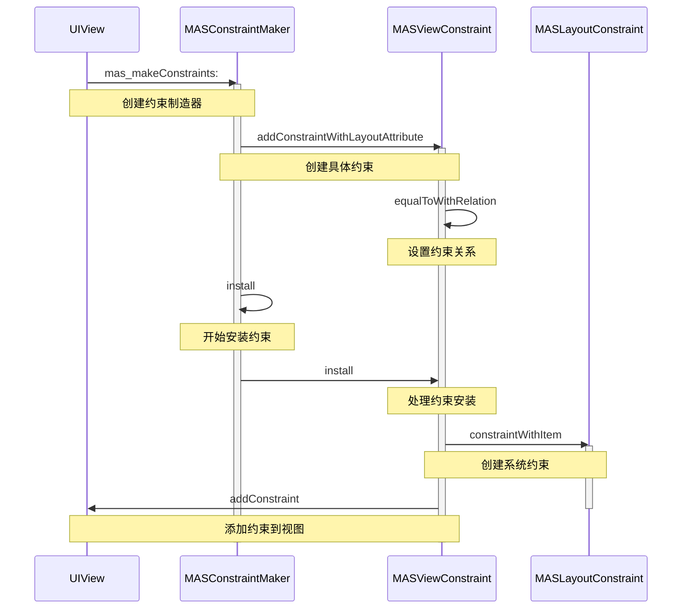

# Masonry 源码解析：优雅的自动布局方案

在 iOS 开发中，布局是一个永恒的话题。[Masonry](https://github.com/SnapKit/Masonry) 作为一个广受欢迎的自动布局框架，以其简洁的链式语法优雅地解决了这个问题。今天，让我们揭开它的神秘面纱，一起探索其内部实现原理。

## 从使用体验说起

在深入源码之前，我们先看看 Masonry 是如何简化我们的日常开发工作的。下面是一个典型的使用示例：

```objc
[view mas_makeConstraints:^(MASConstraintMaker *make) {
    make.top.equalTo(superview.mas_top).with.offset(padding.top);
    make.left.equalTo(superview.mas_left).with.offset(padding.left);
    make.bottom.equalTo(superview.mas_bottom).with.offset(-padding.bottom);
    make.right.equalTo(superview.mas_right).with.offset(-padding.right);
}];
```

这段代码展示了 Masonry 的核心特点：通过一个优雅的 block 语法，我们可以用链式调用的方式设置视图的约束。`make` 参数就像是 `view` 的一个代理，当我们写下：

```objc
make.top.equalTo(superview.mas_top).with.offset(padding.top);
```

实际上就相当于在表达：

```objc
view.top.equalTo(superview.mas_top).with.offset(padding.top);
```

## 揭秘内部实现

### 约束创建的入口：mas_makeConstraints:

让我们从约束创建的入口开始探索。通过查看 `mas_makeConstraints:` 的实现，我们可以看到整个过程的开端：

```objc
- (NSArray *)mas_makeConstraints:(void(^)(MASConstraintMaker *))block {
    self.translatesAutoresizingMaskIntoConstraints = NO;
    MASConstraintMaker *constraintMaker = [[MASConstraintMaker alloc] initWithView:self];
    block(constraintMaker);
    return [constraintMaker install];
}
```

这个方法做了三件关键的事：
1. 禁用自动转换约束的功能，这是使用自动布局的必要步骤
2. 创建一个约束制造器（`MASConstraintMaker`）
3. 执行用户的约束设置代码，并最终安装这些约束

### 约束制造器：MASConstraintMaker

`MASConstraintMaker` 是整个框架的核心，它负责创建和管理约束。让我们看看它是如何工作的：

```objc
@interface MASConstraintMaker : NSObject
@property (nonatomic, weak) MAS_VIEW *view;
@property (nonatomic, strong) NSMutableArray *constraints;

- (id)initWithView:(MAS_VIEW *)view;
@end

@implementation MASConstraintMaker
- (id)initWithView:(MAS_VIEW *)view {
    self = [super init];
    if (!self) return nil;
    
    self.view = view;
    self.constraints = NSMutableArray.new;
    return self;
}
@end
```

约束制造器持有对目标视图的弱引用，并维护一个约束数组。当我们使用链式语法时，每个属性访问（如 `make.left`）都会创建一个新的约束对象：

```objc
- (MASConstraint *)left {
    return [self addConstraintWithLayoutAttribute:NSLayoutAttributeLeft];
}
```

### 约束的安装过程

当所有约束都配置完成后，`install` 方法会被调用来实际安装这些约束：

```objc
- (NSArray *)install {
    if (self.removeExisting) {
        NSArray *installedConstraints = [MASViewConstraint installedConstraintsForView:self.view];
        for (MASConstraint *constraint in installedConstraints) {
            [constraint uninstall];
        }
    }
    
    NSArray *constraints = self.constraints.copy;
    for (MASConstraint *constraint in constraints) {
        constraint.updateExisting = self.updateExisting;
        [constraint install];
    }
    [self.constraints removeAllObjects];
    return constraints;
}
```

### 约束的具体实现：MASViewConstraint

`MASViewConstraint` 是实际的约束封装类，它负责处理具体的约束关系。每个约束本质上都是在处理两个视图属性之间的关系：

```objc
@interface MASViewConstraint : NSObject
@property (nonatomic, strong, readonly) MASViewAttribute *firstViewAttribute;
@property (nonatomic, strong, readonly) MASViewAttribute *secondViewAttribute;
@end
```

这两个属性分别对应约束等式的左右两边：

> item1.attribute1 = multiplier × item2.attribute2 + constant

约束的安装过程也是在这个类中完成的：

```objc
- (void)install {
    if (self.hasBeenInstalled) return;
    
    MAS_VIEW *firstLayoutItem = self.firstViewAttribute.item;
    NSLayoutAttribute firstLayoutAttribute = self.firstViewAttribute.layoutAttribute;
    MAS_VIEW *secondLayoutItem = self.secondViewAttribute.item;
    NSLayoutAttribute secondLayoutAttribute = self.secondViewAttribute.layoutAttribute;

    // 处理特殊情况，如 equalTo(@10)
    if (!self.firstViewAttribute.isSizeAttribute && !self.secondViewAttribute) {
        secondLayoutItem = self.firstViewAttribute.view.superview;
        secondLayoutAttribute = firstLayoutAttribute;
    }
    
    // 创建实际的布局约束
    MASLayoutConstraint *layoutConstraint =
        [MASLayoutConstraint constraintWithItem:firstLayoutItem
                                    attribute:firstLayoutAttribute
                                    relatedBy:self.layoutRelation
                                       toItem:secondLayoutItem
                                    attribute:secondLayoutAttribute
                                   multiplier:self.layoutMultiplier
                                     constant:self.layoutConstant];
    
    // 确定约束应该被添加到哪个视图上
    if (self.secondViewAttribute.view) {
        self.installedView = [self.firstViewAttribute.view mas_closestCommonSuperview:self.secondViewAttribute.view];
    } else if (self.firstViewAttribute.isSizeAttribute) {
        self.installedView = self.firstViewAttribute.view;
    } else {
        self.installedView = self.firstViewAttribute.view.superview;
    }
    
    // 添加约束
    [self.installedView addConstraint:layoutConstraint];
    self.layoutConstraint = layoutConstraint;
}
```

## 设计精髓

通过分析 Masonry 的源码，我们可以看到它的几个关键设计思想：



1. **职责分离**：每个类都有其明确的职责
   - UIView：作为约束的载体
   - MASConstraintMaker：约束创建的管理者
   - MASViewConstraint：具体约束的封装
   - MASLayoutConstraint：系统约束的包装

2. **链式调用**：通过巧妙的方法设计，实现了流畅的链式语法

3. **封装复杂性**：将复杂的约束创建和安装过程隐藏在简洁的接口之后

通过这种精心的设计，Masonry 成功地将 AutoLayout 的复杂性转化为了优雅的链式调用，这也是它能够广受欢迎的重要原因。


