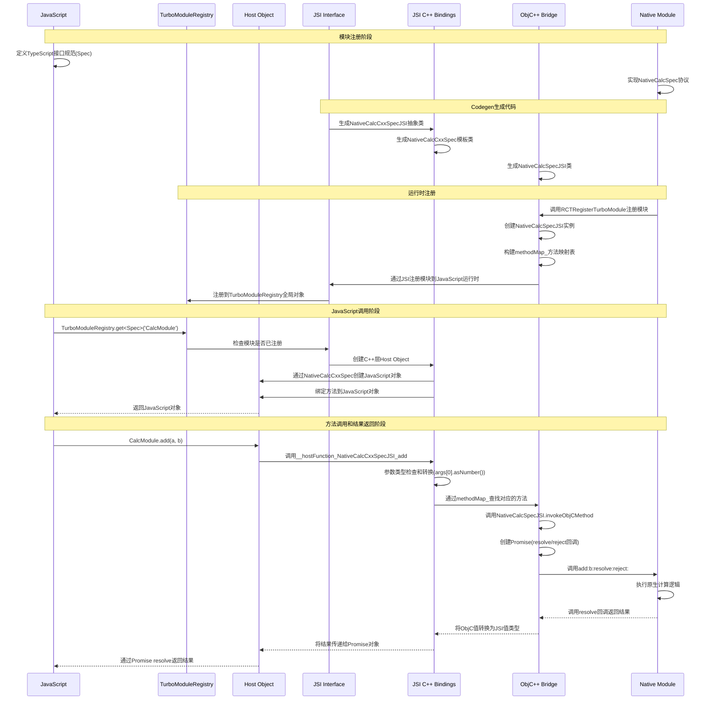

# React Native 通信机制详解 - 新架构

## 一、概述

本篇是 React Native 通信机制详解的第二篇文章，主要介绍 React Native 新架构下的通信机制。如果想要了解旧架构下的通信机制，可以参考[上一篇](./react_native_message_old.md)文章。

## 二、示例

我们仍然从[前文](./react_native_new_arch.md)末展示的新架构下注册一个原生模块的示例开始。如果你有兴趣自己动手实践下整个过程，可以参考 React Native 的[官方文档](https://reactnative.dev/docs/the-new-architecture/using-codegen)：

1.**定义模块规范（TypeScript）**

首先，我们需要使用 TypeScript 定义模块的接口规范。通过继承 `TurboModule` 接口，我们可以声明模块的方法签名，包括参数类型和返回值类型。

```typescript
// CalcModule.ts
import type { TurboModule } from 'react-native/Libraries/TurboModule/RCTExport';
import { TurboModuleRegistry } from 'react-native';

export interface Spec extends TurboModule {
  add(a: number, b: number): Promise<number>;
}

export default TurboModuleRegistry.get<Spec>('CalcModule');
```

最后将这个文件命名为 `NativeCalcModule.ts`。文件名中的 `Native` 前缀是一个约定的命名方式，表示这是一个原生模块，这样 Codegen 工具才能生成对应的原生代码。

2.**使用 Codegen 生成接口代码**

接下来，我们使用 Codegen 工具将 TypeScript 定义转换为 Objective-C 桥接代码以及 JSI 绑定代码。

```bash
.
├── CalcModule
│   ├── CalcModule-generated.mm
│   └── CalcModule.h
├── CalcModuleJSI-generated.cpp
├── CalcModuleJSI.h
├── RCTAppDependencyProvider.h
├── RCTAppDependencyProvider.mm
├── RCTModulesConformingToProtocolsProvider.h
├── RCTModulesConformingToProtocolsProvider.mm
├── RCTThirdPartyComponentsProvider.h
├── RCTThirdPartyComponentsProvider.mm
├── ReactAppDependencyProvider.podspec
└── ReactCodegen.podspec.json

1 directory, 12 files
```

在生成目录下，`CalcModule.h`和`CalcModule-generated.mm`是 Objective-C 桥接代码，`CalcModuleJSI.h`和`CalcModuleJSI-generated.cpp`是 JSI 绑定代码。

3.**实现原生模块**

最后，我们实现原生模块的具体功能。

```objc
@interface CalcModule : NSObject <NativeCalcSpec>
@end

@implementation CalcModule
RCT_EXPORT_MODULE()

- (void)add:(double)a b:(double)b resolve:(RCTPromiseResolveBlock)resolve reject:(RCTPromiseRejectBlock)reject
{
  NSNumber *result = @(a + b);
  resolve(result);
}
@end
```

## 三、模块注册机制

让我们结合上文中的示例代码生成的内容，来深入了解新架构下模块注册和调用的完整流程。

### 3.1 Codegen 生成代码

#### Objc 桥接层

Objective-C 这一层首先定义了一个 `NativeCalcSpec` 协议，它继承自 `RCTBridgeModule` 和 `RCTTurboModule`。开发者需要自己来实现这个协议，来提供 add 方法的实际实现。其次，定义了一个 `NativeCalcSpecBase` 类，它是 `NativeCalcSpec` 协议的基类，用于实现一些公共的方法。最后，定义了一个 `NativeCalcSpecJSI` 类，它是一个 Objective-C 桥接类，继承自 `ObjCTurboModule`，用于构建方法映射表并将 C++ 调用转发给 Objective-C 方法。

```objc
// CalcModule.h
#ifndef CalcModule_H
#define CalcModule_H

NS_ASSUME_NONNULL_BEGIN

@protocol NativeCalcSpec <RCTBridgeModule, RCTTurboModule>

- (void)add:(double)a
          b:(double)b
    resolve:(RCTPromiseResolveBlock)resolve
     reject:(RCTPromiseRejectBlock)reject;

@end

@interface NativeCalcSpecBase : NSObject {
@protected
facebook::react::EventEmitterCallback _eventEmitterCallback;
}
- (void)setEventEmitterCallback:(EventEmitterCallbackWrapper *)eventEmitterCallbackWrapper;

@end

namespace facebook::react {
  /**
   * ObjC++ class for module 'NativeCalc'
   */
  class JSI_EXPORT NativeCalcSpecJSI : public ObjCTurboModule {
  public:
    NativeCalcSpecJSI(const ObjCTurboModule::InitParams &params);
  };
} // namespace facebook::react

NS_ASSUME_NONNULL_END
#endif // CalcModule_H
```

```objc
// CalcModule-generated.mm
#import "CalcModule.h"

@implementation NativeCalcSpecBase

- (void)setEventEmitterCallback:(EventEmitterCallbackWrapper *)eventEmitterCallbackWrapper
{
  _eventEmitterCallback = std::move(eventEmitterCallbackWrapper->_eventEmitterCallback);
}
@end

namespace facebook::react {
  
  static facebook::jsi::Value __hostFunction_NativeCalcSpecJSI_add(facebook::jsi::Runtime& rt, TurboModule &turboModule, const facebook::jsi::Value* args, size_t count) {
    return static_cast<ObjCTurboModule&>(turboModule).invokeObjCMethod(rt, PromiseKind, "add", @selector(add:b:resolve:reject:), args, count);
  }

  NativeCalcSpecJSI::NativeCalcSpecJSI(const ObjCTurboModule::InitParams &params)
    : ObjCTurboModule(params) {
      
        methodMap_["add"] = MethodMetadata {2, __hostFunction_NativeCalcSpecJSI_add};
        
  }
} // namespace facebook::react
```

#### JSI 桥接层

JSI 的这一层中主要是定义了两个类： `NativeCalcCxxSpecJSI` 和 `NativeCalcCxxSpec`。前者是一个 C++ 抽象类，定义了模块方法的 C++ 接口。后者是一个 C++ 模板类，用于创建 Host Object，将 JavaScript 调用转发给原生方法，以及处理参数和返回值的类型转换。

```cpp
// CalcModuleJSI.h
#include <ReactCommon/TurboModule.h>
#include <react/bridging/Bridging.h>

namespace facebook::react {
  class JSI_EXPORT NativeCalcCxxSpecJSI : public TurboModule {
  protected:
    NativeCalcCxxSpecJSI(std::shared_ptr<CallInvoker> jsInvoker);

  public:
    virtual jsi::Value add(jsi::Runtime &rt, double a, double b) = 0;
  };

  template <typename T>
  class JSI_EXPORT NativeCalcCxxSpec : public TurboModule {
  public:
    jsi::Value create(jsi::Runtime &rt, const jsi::PropNameID &propName) override {
      return delegate_.create(rt, propName);
    }

    std::vector<jsi::PropNameID> getPropertyNames(jsi::Runtime& runtime) override {
      return delegate_.getPropertyNames(runtime);
    }

    static constexpr std::string_view kModuleName = "CalcModule";

  protected:
    NativeCalcCxxSpec(std::shared_ptr<CallInvoker> jsInvoker)
      : TurboModule(std::string{NativeCalcCxxSpec::kModuleName}, jsInvoker),
        delegate_(reinterpret_cast<T*>(this), jsInvoker) {}


  private:
    class Delegate : public NativeCalcCxxSpecJSI {
    public:
      Delegate(T *instance, std::shared_ptr<CallInvoker> jsInvoker) :
        NativeCalcCxxSpecJSI(std::move(jsInvoker)), instance_(instance) {

      }

      jsi::Value add(jsi::Runtime &rt, double a, double b) override {
        static_assert(
            bridging::getParameterCount(&T::add) == 3,
            "Expected add(...) to have 3 parameters");

        return bridging::callFromJs<jsi::Value>(
            rt, &T::add, jsInvoker_, instance_, std::move(a), std::move(b));
      }

    private:
      friend class NativeCalcCxxSpec;
      T *instance_;
    };

    Delegate delegate_;
  };

} // namespace facebook::react
```

```cpp
#include "CalcModuleJSI.h"

namespace facebook::react {

  static jsi::Value __hostFunction_NativeCalcCxxSpecJSI_add(jsi::Runtime &rt, TurboModule &turboModule, const jsi::Value* args, size_t count) {
    return static_cast<NativeCalcCxxSpecJSI *>(&turboModule)->add(
      rt,
      count <= 0 ? throw jsi::JSError(rt, "Expected argument in position 0 to be passed") : args[0].asNumber(),
      count <= 1 ? throw jsi::JSError(rt, "Expected argument in position 1 to be passed") : args[1].asNumber()
    );
  }

  NativeCalcCxxSpecJSI::NativeCalcCxxSpecJSI(std::shared_ptr<CallInvoker> jsInvoker)
    : TurboModule("CalcModule", jsInvoker) {
    methodMap_["add"] = MethodMetadata {2, __hostFunction_NativeCalcCxxSpecJSI_add};
  }
} // namespace facebook::react
```

### 3.2 原生模块实现

开发者需要创建一个遵循 `NativeCalcSpec` 协议的类：

```objc
@interface CalcModule : NSObject <NativeCalcSpec>
@end

@implementation CalcModule
RCT_EXPORT_MODULE()

- (void)add:(double)a b:(double)b resolve:(RCTPromiseResolveBlock)resolve reject:(RCTPromiseRejectBlock)reject
{
  NSNumber *result = @(a + b);
  resolve(result);
}
@end
```

并且用 `RCT_EXPORT_MODULE()` 宏来将这个类暴露给 React Native。`RCT_EXPORT_MODULE()`在编译时会展开成：

```objc
+ (NSString *)moduleName { return @"CalcModule"; }
+ (void)load { RCTRegisterTurboModule(self); }
```

这个过程同旧架构中的 `RCT_EXPORT_MODULE()` 宏类似，但也不完全相同。旧架构中的`RCT_EXPORT_MODULE()`宏会在编译时调用`RCTRegisterModule(class)`将模块注册到`RCTModuleRegistry`中，而新架构中的`RCT_EXPORT_MODULE()`宏则会在运行时调用`RCTRegisterTurboModule(class)`将模块注册到`TurboModuleRegistry`中。

### 3.3 RCTRegisterTurboModule 实现原理

`RCTRegisterTurboModule` 是新架构中的核心注册机制，它主要完成以下三个任务：

1.**创建模块工厂**

```cpp
static std::unordered_map<std::string, TurboModuleFactory> turboModuleFactories;

void RCTRegisterTurboModule(Class moduleClass) {
  NSString *moduleName = [moduleClass moduleName];
  turboModuleFactories[moduleName.UTF8String] = [moduleClass](jsi::Runtime &runtime) {
    return std::make_shared<NativeCalcSpecJSI>(runtime, moduleClass);
  };
}
```

这里使用 C++ 模板机制创建了一个模块工厂函数，用于按需创建模块实例。工厂函数以模块名为键，存储在全局的 `turboModuleFactories` 映射表中。

2.**维护模块元数据**

```cpp
class TurboModuleMetadata {
  std::string name;
  std::unordered_map<std::string, MethodMetadata> methods;
  std::shared_ptr<CallInvoker> jsInvoker;
};

void RCTRegisterTurboModule(Class moduleClass) {
  // ... 前面的代码 ...
  
  // 收集模块的方法信息
  auto metadata = std::make_shared<TurboModuleMetadata>();
  metadata->name = moduleName.UTF8String;
  metadata->jsInvoker = jsInvoker;
  
  // 通过运行时反射获取模块的方法列表
  unsigned int methodCount;
  Method *methods = class_copyMethodList(moduleClass, &methodCount);
  for (unsigned int i = 0; i < methodCount; i++) {
    Method method = methods[i];
    metadata->methods[sel_getName(method_getName(method))] = {
      .argumentCount = method_getNumberOfArguments(method) - 2,
      .returnType = method_getReturnType(method)
    };
  }
  free(methods);
  
  // 存储元数据
  turboModuleMetadata[moduleName.UTF8String] = metadata;
}
```

这部分代码负责维护模块的元数据，包括模块名、方法列表、参数类型等信息。这些信息在后续的方法调用中用于参数类型检查和转换。

3.**JSI 绑定**

```cpp
void RCTRegisterTurboModule(Class moduleClass) {
  // ... 前面的代码 ...
  
  // 创建 JSI 绑定
  jsi::Runtime &runtime = ...; // 获取 JSI 运行时
  auto moduleObject = jsi::Object(runtime);
  
  // 为每个方法创建 JSI 函数
  for (const auto &method : metadata->methods) {
    moduleObject.setProperty(
      runtime,
      method.first.c_str(),
      jsi::Function::createFromHostFunction(
        runtime,
        jsi::PropNameID::forAscii(runtime, method.first),
        method.second.argumentCount,
        [metadata, method](jsi::Runtime &rt, const jsi::Value &thisVal, const jsi::Value *args, size_t count) {
          // 参数类型检查和转换
          // 调用原生方法
          // 返回结果转换
          return ...; // 返回 JSI 值
        }
      )
    );
  }
  
  // 将模块对象注册到 TurboModuleRegistry
  runtime.global().getProperty(runtime, "__turboModuleProxy")
    .asObject(runtime)
    .setProperty(runtime, moduleName.UTF8String, moduleObject);
}
```

这部分代码通过 JSI 机制将原生模块暴露给 JavaScript 环境。它为每个原生方法创建对应的 JSI 函数，使其能够直接访问原生代码，无需通过 Bridge 进行序列化和反序列化。

通过以上三个步骤，`RCTRegisterTurboModule` 完成了新架构中原生模块的注册过程。

### 3.4 小结

在新架构下，定义一个原生模块需要先在 JavaScript 层定义一个 Spec 文件，然后用 Codegen 生成 JSI、C++ 的胶水代码。下面总结一下这些不同层次代码的作用：

#### JavaScript 层

**Spec 接口**：TypeScript 定义的模块接口规范
**TurboModuleRegistry**：负责获取和管理 TurboModule 实例

#### C++ 层

**NativeCalcCxxSpecJSI**：C++ 抽象类，定义了模块方法的 C++ 接口
**NativeCalcCxxSpec**：C++ 模板类，用于创建 Host Object
**TurboModule**：所有 TurboModule 的基类

#### ObjC++ 层

**NativeCalcSpecJSI**：ObjC++ 桥接类，继承自 ObjCTurboModule
**ObjCTurboModule**：ObjC++ TurboModule 的基类

#### Objective-C 层

**NativeCalcSpec**：Objective-C 协议，定义了原生模块需要实现的方法
**CalcModule**：开发者实现的原生模块类

## 四、通信流程详解

让我们继续分析下 JavaScript 和原生模块实现通信的原理。

当 JavaScript 代码首次导入模块时：

```javascript
import CalcModule from './NativeCalcModule';
```

实际上是调用了 `TurboModuleRegistry.get<Spec>('CalcModule')` 方法。这个方法的执行流程如下：

1. **检查模块缓存**：首先检查模块是否已经被加载过，如果已加载则直接返回缓存的实例。

2. **获取原生模块**：如果模块未加载，则通过 JSI 调用原生方法 `__turboModuleProxy.getModule('CalcModule')`。

3. **创建 Host Object**：原生层会调用之前注册的模块工厂函数，创建一个 `NativeCalcCxxSpec` 实例作为 Host Object。

4. **绑定方法**：Host Object 会将所有在 TypeScript 中定义的方法绑定到 JavaScript 对象上。

5. **缓存模块实例**：将创建的模块实例缓存起来，以便后续使用。

6. **返回 JavaScript 对象**：最终返回一个 JavaScript 对象，该对象的方法实际上是与原生方法绑定的 JSI 函数。

当 JavaScript 调用 `CalcModule.add(1, 2)` 时：

1. **JavaScript 引擎执行调用**：JavaScript 引擎识别到这是对一个对象方法的调用。

2. **JSI 拦截调用**：由于 `CalcModule` 是一个 Host Object，其方法调用会被 JSI 拦截。

3. **查找方法映射**：JSI 根据方法名 `add` 在 Host Object 的 `methodMap_` 中查找对应的处理函数，找到 `__hostFunction_NativeCalcCxxSpecJSI_add`。

4. **执行 Host 函数**：调用 `__hostFunction_NativeCalcCxxSpecJSI_add` 函数，传入 JavaScript 运行时、模块实例和参数数组。

5. **参数类型转换**：Host 函数会将 JavaScript 参数转换为 C++ 类型，例如将 `args[0]` 和 `args[1]` 转换为 `double` 类型。

```cpp
return static_cast<NativeCalcCxxSpecJSI *>(&turboModule)->add(
  rt,
  count <= 0 ? throw jsi::JSError(rt, "Expected argument in position 0 to be passed") : args[0].asNumber(),
  count <= 1 ? throw jsi::JSError(rt, "Expected argument in position 1 to be passed") : args[1].asNumber()
);
```

6. **调用 C++ 方法**：转发调用到 `NativeCalcCxxSpecJSI::add` 方法。

7. **桥接到 ObjC++**：C++ 层通过 `bridging::callFromJs` 将调用转发到 ObjC++ 层的 `NativeCalcSpecJSI`。

```cpp
class Delegate : public NativeCalcCxxSpecJSI {
    public:
      jsi::Value add(jsi::Runtime &rt, double a, double b) override {
        static_assert(
            bridging::getParameterCount(&T::add) == 3,
            "Expected add(...) to have 3 parameters");

        return bridging::callFromJs<jsi::Value>(
            rt, &T::add, jsInvoker_, instance_, std::move(a), std::move(b));
      }
};
```

8. **ObjC++ 层处理**：`NativeCalcSpecJSI` 的 `invokeObjCMethod` 方法负责将 JSI 参数转换为 Objective-C 类型，并创建 Promise 对象。

```objc
- (jsi::Value)invokeObjCMethod:(jsi::Runtime &)runtime
                   methodKind:(MethodKind)methodKind
                   methodName:(const char *)methodName
                      method:(SEL)selector
                        args:(const jsi::Value *)args
                        count:(size_t)count {
  // 创建 Promise 对象
  if (methodKind == MethodKind::Promise) {
    return createPromise(runtime,
      ^(jsi::Runtime &rt, std::shared_ptr<Promise> promise) {
        // 创建 resolve 和 reject 回调
        RCTPromiseResolveBlock resolveBlock = ^(id result) {
          promise->resolve(rt, convertObjCValueToJSIValue(rt, result));
        };
        RCTPromiseRejectBlock rejectBlock = ^(NSString *code, NSString *message, NSError *error) {
          promise->reject(rt, [code UTF8String], [message UTF8String], error);
        };
        
        // 调用原生方法
        [instance selector:args[0].asNumber()
                        b:args[1].asNumber()
                  resolve:resolveBlock
                   reject:rejectBlock];
    });
  }
}
```

9. **原生方法执行**：原生方法执行完成后，通过 Promise 的 resolve 或 reject 回调返回结果。

10. **结果返回**：

   - 如果执行成功，调用 `resolve` 回调，将 Objective-C 的结果值转换为 JSI 值。
   - 如果执行失败，调用 `reject` 回调，将错误信息传递给 JavaScript。
   - JSI 层将结果传递给 Promise 对象，最终返回给 JavaScript 层。

这种多层转发机制不仅确保了 JavaScript 和原生代码之间的类型安全和高效通信，还保持了代码的模块化和可维护性。完整的通信流程如下图所示：



## 五、小结

通过上述详细分析，我们深入了解了 React Native 新架构下 JavaScript 和原生模块之间的通信机制。相比旧架构，新架构在通信方面有以下几个显著改进：

1. **直接通信**：通过 JSI（JavaScript Interface）实现 JavaScript 和原生代码的直接通信，无需通过 Bridge 进行序列化和反序列化，大幅提升性能。

2. **类型安全**：借助 Codegen 工具，从 TypeScript 接口定义自动生成原生代码，确保了 JavaScript 和原生代码之间的类型一致性，减少了运行时错误。

3. **模块化设计**：TurboModule 系统允许按需加载原生模块，减少了应用启动时间和内存占用。

4. **多层架构**：新架构采用了多层设计（JavaScript、JSI、C++、ObjC++、Objective-C），每一层都有明确的职责，使得代码更加模块化和可维护。
