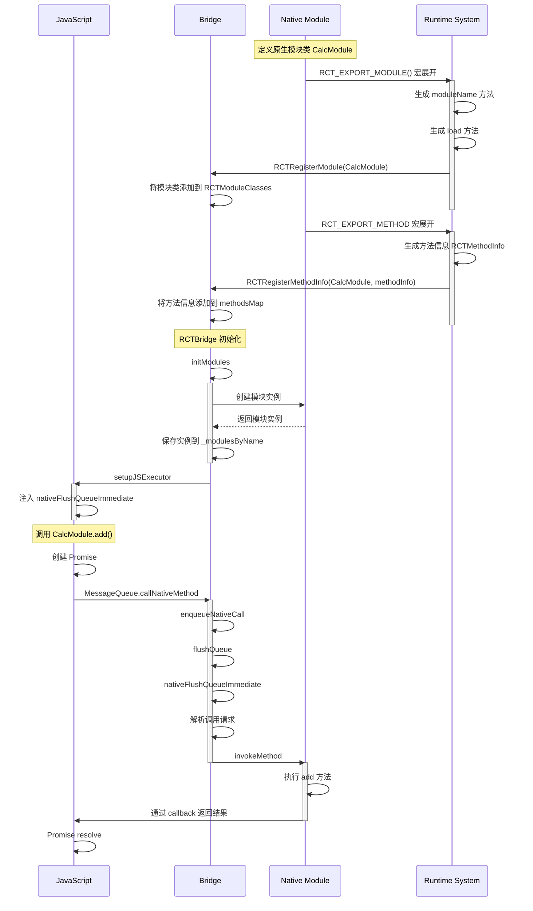

# React Native 通信机制详解 - 旧架构

## 一、概述

在[前文](./react_native_new_arch.md)中，我们介绍了 React Native 的新旧两种架构，并在文章末尾给出了在新旧两种架构中，注册实现一个原生模块的方式。由于篇幅限制，并未对这个过程中的底层原理进行深入介绍。接下来，我们将聚焦于此，深入探讨 React Native 新旧架构下原生模块和 JavaScript 调用的底层实现。

本篇是 React Native 通信机制详解的第一篇文章，主要介绍 React Native 旧架构下的通信机制。

## 二、示例

回顾下前文中注册一个原生模块的过程：

1.**定义原生模块类**

首先需要创建一个继承自 `NSObject` 并遵循 `RCTBridgeModule` 协议的类。

```objc
// CalcModule.h
#import <React/RCTBridgeModule.h>

@interface CalcModule : NSObject <RCTBridgeModule>
@end
```

2.**实现模块方法**

在实现文件中，我们使用 `RCT_EXPORT_MODULE()` 宏来导出模块，并通过 `RCT_EXPORT_METHOD` 宏来导出具体的方法。

```objc
// CalcModule.m
#import "CalcModule.h"

@implementation CalcModule

RCT_EXPORT_MODULE()

RCT_EXPORT_METHOD(add:(NSInteger)a
                  b:(NSInteger)b
                  callback:(RCTResponseSenderBlock)callback)
{
    NSInteger result = a + b;
    callback(@[@(result)]);
}

@end
```

3.**导出模块到 JavaScript**

最后，我们在 JavaScript 端使用这个原生模块。

```javascript
// Calculator.js
import { NativeModules } from 'react-native';

const { CalcModule } = NativeModules;

export const add = (a, b) => {
  return new Promise((resolve) => {
    CalcModule.add(a, b, (result) => {
      resolve(result);
    });
  });
};
```

## 三、模块注册机制

在旧架构中，原生模块的注册和原生模块中方法的暴露分别是通过 `RCT_EXPORT_MODULE()` 和 `RCT_EXPORT_METHOD`宏来实现的。将上述代码进行宏展开：

```objc
// RCT_EXPORT_MODULE() 宏展开
@implementation CalcModule

// 生成模块名映射函数
+ (NSString *)moduleName {
    return @"CalcModule";
}

// 注册模块到 Bridge
+ (void)load {
    RCTRegisterModule(self);
}

// RCT_EXPORT_METHOD 宏展开
- (void)__rct_export__add_a_b_callback {
    RCTMethodInfo methodInfo = {
        .objcName = "add:b:callback:",
        .jsName = "add",
        .isSync = NO
    };
    RCTRegisterMethodInfo(self, methodInfo);
}

// 原始方法实现
- (void)add:(NSInteger)a
          b:(NSInteger)b
  callback:(RCTResponseSenderBlock)callback
{
    NSInteger result = a + b;
    callback(@[@(result)]);
}

@end
```

`RCT_EXPORT_MODULE()` 宏会在类的 +load 方法中调用 `RCTRegisterModule(class)` 函数，将模块注册到 Bridge。`RCT_EXPORT_METHOD` 宏则会调用 `RCTRegisterMethodInfo`，将方法信息注册到 Bridge。

```objc
// RCTRegisterModule 实现
static NSMutableArray<Class> *RCTModuleClasses;
static dispatch_once_t onceToken;

void RCTRegisterModule(Class moduleClass)
{
    dispatch_once(&onceToken, ^{
        RCTModuleClasses = [NSMutableArray new];
    });

    // 确保类遵循 RCTBridgeModule 协议
    if ([moduleClass conformsToProtocol:@protocol(RCTBridgeModule)]) {
        // 添加到全局模块注册表
        [RCTModuleClasses addObject:moduleClass];
    }
}
```

这个方法的实质是将当前 module 加入到一个全局的变量 RCTModuleClasses中。

```objc
// RCTRegisterMethodInfo 实现
static NSMutableDictionary<NSString *, NSMutableSet<RCTMethodInfo *> *> *methodsMap;
static dispatch_once_t methodMapOnceToken;

void RCTRegisterMethodInfo(Class moduleClass, RCTMethodInfo methodInfo)
{
    dispatch_once(&methodMapOnceToken, ^{
        methodsMap = [NSMutableDictionary new];
    });

    // 获取或创建模块的方法集合
    NSString *moduleName = [moduleClass moduleName];
    NSMutableSet *methods = methodsMap[moduleName];
    if (!methods) {
        methods = [NSMutableSet new];
        methodsMap[moduleName] = methods;
    }

    // 添加方法信息到方法集合
    RCTMethodInfo *info = [[RCTMethodInfo alloc] init];
    info.objcName = methodInfo.objcName;
    info.jsName = methodInfo.jsName;
    info.isSync = methodInfo.isSync;
    [methods addObject:info];
}
```

这个方法的实质则是将当前 module 对应的方法信息加入到一个全局的变量 methodsMap中。

当 RCTBridge 初始化时，会遍历 `RCTModuleClasses` 数组，为每个注册的模块类创建实例：

```objc
- (void)initModules
{
    // 遍历已注册的模块类
    for (Class moduleClass in RCTModuleClasses) {
        // 创建模块实例
        id<RCTBridgeModule> module = [[moduleClass alloc] init];
        
        // 将模块实例添加到 bridge 的模块表中
        NSString *moduleName = [moduleClass moduleName];
        _modulesByName[moduleName] = module;
    }
}
```

当 JavaScript 端调用 `CalcModule.add` 方法时，会先经过 MessageQueue：

```javascript
// MessageQueue.js
class MessageQueue {
  callNativeMethod(moduleID, methodID, params, onFail, onSucc) {
    // 将调用信息放入队列
    this.enqueueNativeCall(moduleID, methodID, params, onFail, onSucc);
    // 触发队列刷新
    this.flushQueue();
  }

  flushQueue() {
    // 将队列中的调用序列化为 JSON
    const calls = JSON.stringify(this._queue);
    // 通过 Bridge 发送到原生层
    global.nativeFlushQueueImmediate(calls);
  }
}
```

而在 React Native 初始化时，会通过 JavaScriptCore 引擎为 JavaScript 环境注入一个全局函数 `nativeFlushQueueImmediate`。这个注入过程发生在 `RCTBridge` 初始化时：

```objc
// RCTBridge.m
- (void)setupJSExecutor
{
    // 获取 JSContext
    JSContext *context = [JSContext new];
    
    // 注入全局函数
    context[@"nativeFlushQueueImmediate"] = ^(JSValue *calls) {
        // 将 JSValue 转换为 NSString
        NSString *callsString = [calls toString];
        
        // 解析调用请求
        NSArray *requests = [NSJSONSerialization JSONObjectWithData:[callsString dataUsingEncoding:NSUTF8StringEncoding]
                                                         options:0
                                                           error:NULL];
        
        // 处理每个调用请求
        for (NSDictionary *request in requests) {
            NSNumber *moduleID = request[@"moduleID"];
            NSString *methodName = request[@"methodID"];
            NSArray *args = request[@"args"];
            
            // 转发到 Bridge 处理
            [self _handleRequestNumber:moduleID
                              method:methodName
                           arguments:args];
        }
    };
}
```

因此当 JavaScript 调用 `global.nativeFlushQueueImmediate(calls)` 时，实际上是调用了上述注入的函数。这个函数会将 JavaScript 传入的调用队列转换为原生数据结构，然后解析出每个调用请求的模块 ID、方法名和参数，最终将请求转发给 `RCTBridge` 的 `_handleRequestNumber:method:arguments:` 方法处理

```objc
// RCTBridge.m
- (void)_handleRequestNumber:(NSNumber *)requestNumber
                    method:(NSString *)method
                   arguments:(NSArray *)arguments
{
    // 序列化参数
    NSData *messageData = [NSJSONSerialization dataWithJSONObject:arguments
                                                        options:0
                                                          error:NULL];
    // 发送到原生模块
    [self enqueueJSCall:method args:messageData];
}
```

最后，原生层通过 `invokeMethod` 方法找到并执行对应的原生实现：

```objc
- (void)invokeMethod:(NSString *)moduleName
           methodName:(NSString *)methodName
            arguments:(NSArray *)arguments
{
    // 获取模块的方法集合
    NSMutableSet<RCTMethodInfo *> *methods = methodsMap[moduleName];
    
    // 查找对应的方法信息
    RCTMethodInfo *methodInfo = nil;
    for (RCTMethodInfo *info in methods) {
        if ([info.jsName isEqualToString:methodName]) {
            methodInfo = info;
            break;
        }
    }
    
    if (methodInfo) {
        // 获取模块实例
        id<RCTBridgeModule> module = _modulesByName[moduleName];
        
        // 通过 performSelector 调用原生方法
        SEL selector = NSSelectorFromString(methodInfo.objcName);
        [module performSelector:selector withArguments:arguments];
    }
}
```

## 四、流程图



## 五、小结

本篇文章主要介绍了 React Native 旧架构下原生模块和 JavaScript 调用的底层实现。通过对模块注册机制和 JavaScript 调用流程的分析，我们深入了解了 React Native 新旧架构下的通信机制。希望本文能帮助你更好地理解 React Native 的通信机制。
