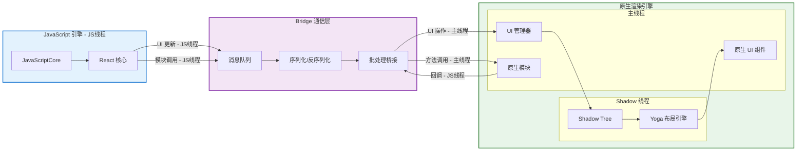
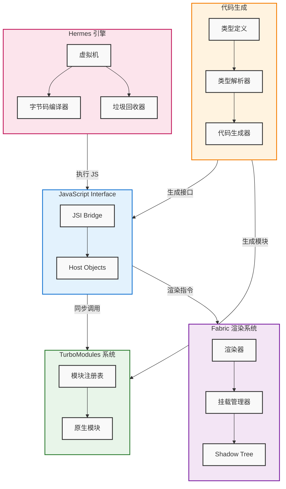
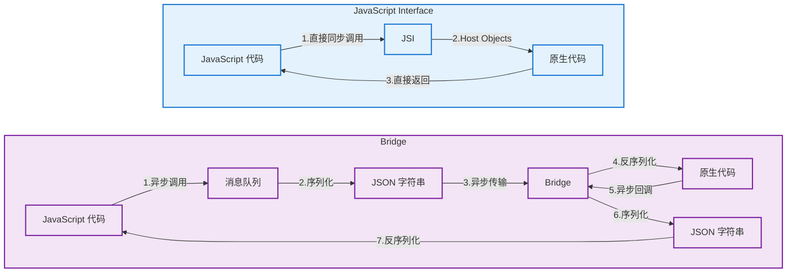
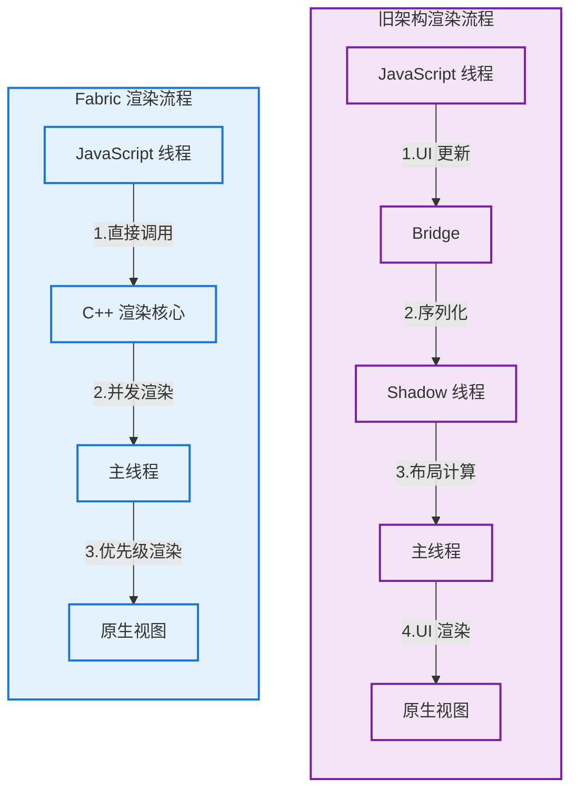
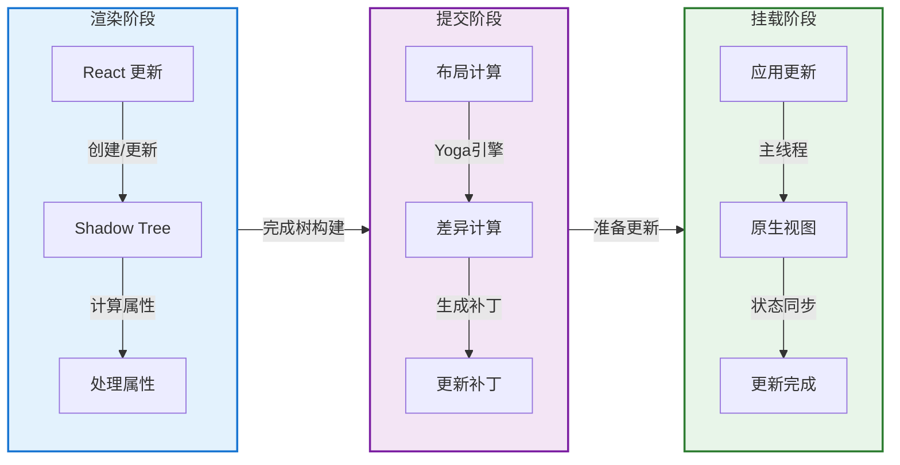
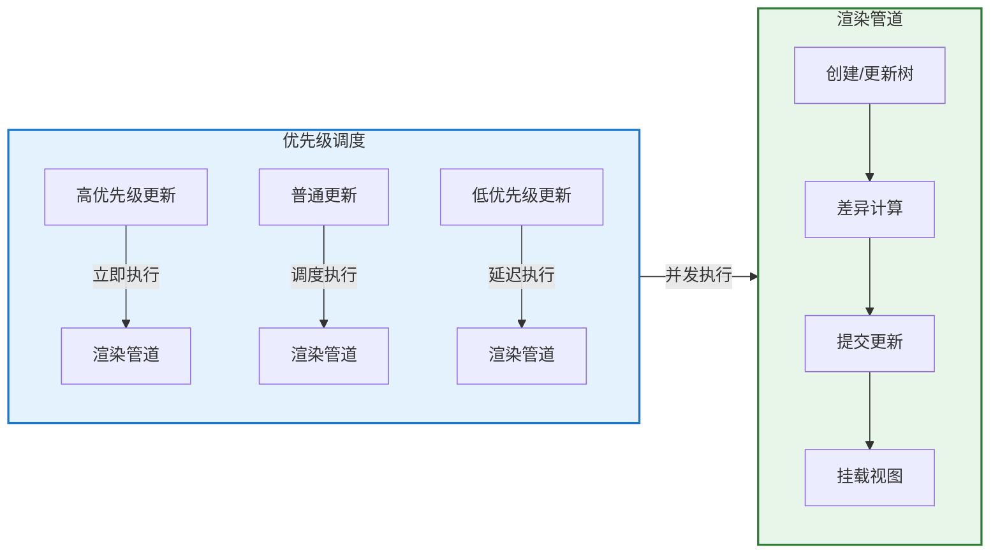
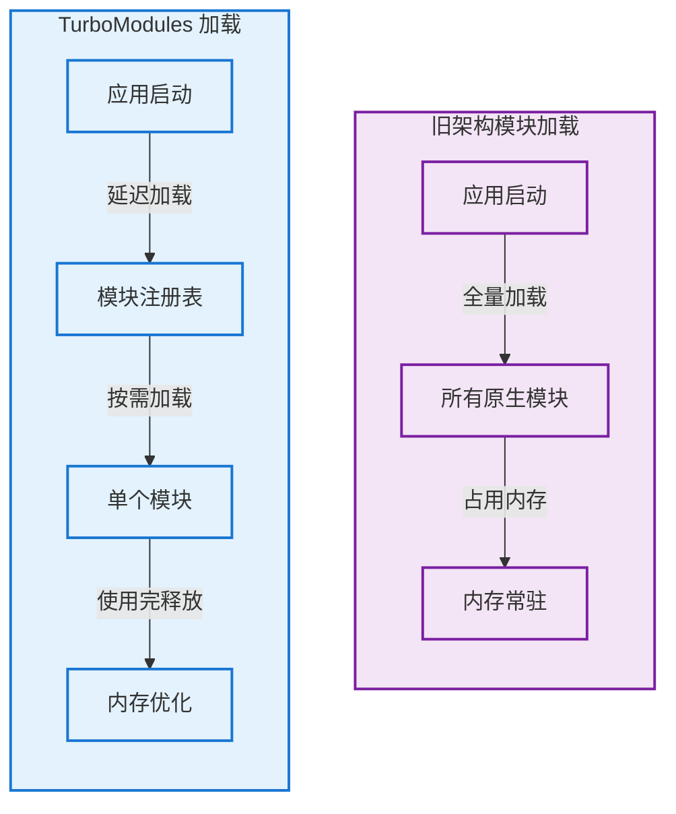
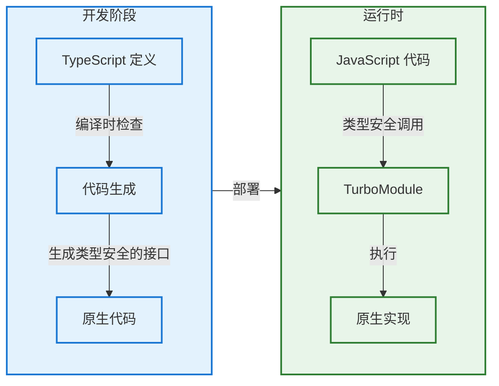
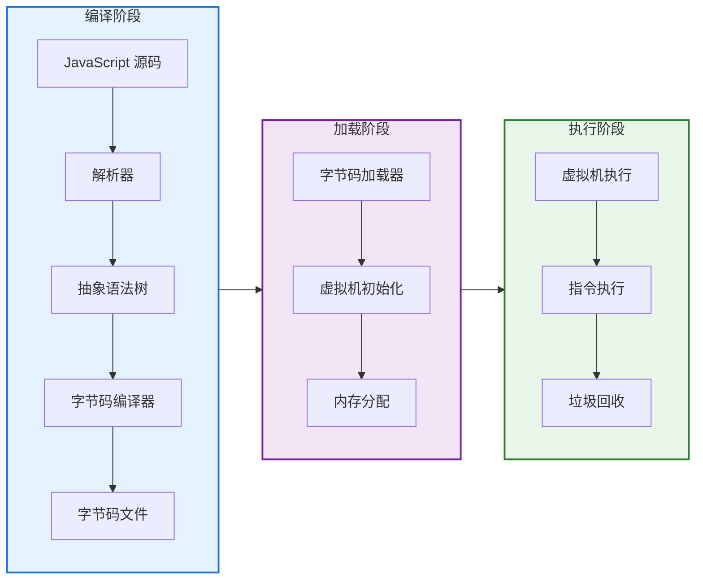
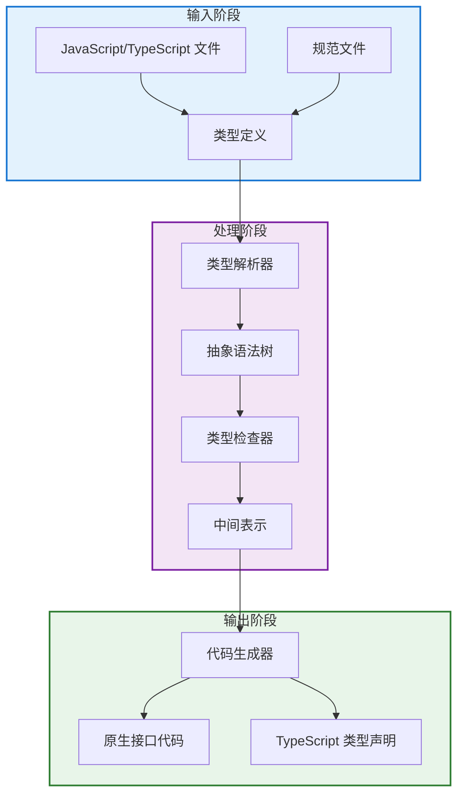

# React Native 新架构学习

## 前言

React Native 是一个用于构建跨平台移动应用的开源框架，它允许开发者使用 JavaScript 和 React 语法来编写应用，然后将其编译为原生平台的代码，如 iOS 和 Android。随着移动应用复杂度的不断提升，React Native 的架构设计也在不断演进。在 0.68 版本中，React Native 团队引入了全新的架构设计，从根本上解决了旧架构中的性能瓶颈，并带来了诸多创新特性。本文将深入探讨 React Native 新架构的设计理念和实现原理，帮助开发者更好地理解和应用这一重要升级。

## React Native 旧架构解析

在介绍新架构之前，自然需要先了解下什么是 React Native 的旧架构，它有哪些问题，这样才能理解为什么需要引入新架构。

React Native 旧架构采用分层设计，实现了 JavaScript 代码在原生平台上的运行。旧架构包含三个主要部分：JavaScript 引擎、Bridge 通信层和原生渲染引擎。



### JavaScript 引擎

JavaScript 引擎负责执行 React 组件代码和业务逻辑。在 iOS 平台使用系统自带的 JavaScriptCore，Android 平台使用打包的 JSC 静态库。这确保了 JavaScript 代码在不同平台上的执行一致性。

### Bridge 通信层

Bridge 通信层负责 JavaScript 和原生代码之间的数据传输，主要通过以下步骤实现：

1. JavaScript 代码调用 UI 更新或原生功能时，将调用放入消息队列
2. 将消息队列中的调用序列化为 JSON 字符串
3. 通过 Bridge 将序列化后的消息发送到原生端
4. 原生代码接收消息并反序列化
5. 执行对应操作，必要时将结果返回给 JavaScript 端

### 原生渲染引擎

原生渲染引擎将 JavaScript 端的 UI 结构转换为原生界面。它使用 Shadow Tree 作为中间层，负责协调 JavaScript 端的视图更新和原生 UI 组件的渲染。

### 旧架构的性能问题

随着应用复杂度的不断提升，React Native 旧架构的性能瓶颈逐渐显现。首先，Bridge 通信机制的设计导致了严重的性能开销。每次 JavaScript 和原生代码之间的通信都需要经过序列化和反序列化的过程，而且消息队列采用串行处理方式，无法支持并发操作，这在数据量较大时会造成明显的性能下降。

其次，旧架构的多线程模型也带来了显著的性能损耗。应用在运行过程中需要在 JavaScript 线程、UI 线程和原生模块线程之间频繁切换，这种频繁的线程切换在复杂的交互场景下会引起明显的界面卡顿，影响用户体验。

最后，布局计算也会带来效率问题。旧架构使用 Yoga 引擎进行布局计算，JavaScript 层和原生层之间需要频繁同步布局信息。这个过程不仅计算量大，而且同步操作本身也会消耗大量时间，从而影响整体渲染性能。

这些性能问题促使 React Native 团队推出了新的架构。

## React Native 新架构解析

React Native 新架构在 0.68 版本引入，它解决了旧架构的性能问题，同时也引入了一些新的特性和优化。

### 关键模块



在新架构中，引入了几个关键模块：`JSI`、`Fabric`、`TurboModules`、`Codegen`以及`Hermes`。

1.**JavaScript Interface (JSI)**

- 取代了旧架构中的 Bridge
- 提供 JavaScript 和原生代码的直接通信能力
- 支持同步调用，无需序列化和反序列化
- 允许 JavaScript 持有原生对象的引用

2.**Fabric 渲染系统**

- 新的渲染器实现，替代旧的 Virtual DOM
- 支持优先级调度的并发渲染
- 使用 C++ 重写了渲染核心，提供跨平台一致性
- 引入 React Suspense 机制处理异步渲染

3.**TurboModules**

- 按需加载原生模块，减少启动时间
- 支持类型安全的原生模块调用
- 通过 JSI 实现同步通信
- 优化内存占用和模块生命周期管理

4.**Codegen**

- 静态代码生成工具
- 在编译时生成类型安全的接口代码
- 支持 TypeScript 类型定义
- 提前发现类型错误，增强代码健壮性

5.**Hermes 引擎**

- 专为 React Native 优化的 JavaScript 引擎
- 通过字节码预编译提升启动性能
- 减少内存占用和包体积
- 与 JSI 无缝集成，支持同步操作
- 提供更好的调试和性能分析工具

### Javascript Interface

在新架构中，JSI 取代了旧架构中的 Bridge 通信层，实现了 JavaScript 和原生代码之间的直接通信。




#### 实现细节

JSI 是通过 C++ 实现的一个轻量级抽象层，它提供了 JavaScript 引擎和原生代码之间的直接通信能力。选择 C++ 作为实现语言主要有以下几个原因：

1.**跨平台一致性**：C++ 作为底层语言，可以在不同平台（iOS、Android）上提供一致的接口和行为，确保了 JSI 的跨平台特性。

2.**性能优势**：C++ 可以直接与系统底层交互，避免了额外的语言绑定开销，同时其高效的内存管理和指针操作特性也有助于提升性能。

3.**与 JavaScript 引擎的集成**：主流的 JavaScript 引擎（如 V8、JavaScriptCore）都提供了 C++ API，使用 C++ 实现 JSI 可以更好地与这些引擎集成。

#### 工作原理

JSI 的工作原理主要包含以下几个方面：

1.**Host 函数注册**：通过 C++ 实现的 JSI，原生模块可以直接将函数注册到 JavaScript 运行时，这些函数可以被 JavaScript 代码同步调用。

2.**对象引用管理**：JSI 维护了一个对象引用系统，使 JavaScript 代码可以安全地持有和操作原生对象，同时确保内存安全和正确的生命周期管理。

3.**类型转换**：JSI 提供了高效的类型转换机制，可以在 JavaScript 和原生类型之间进行快速转换，而无需经过序列化过程。

#### 与其他新架构组件的协同

JSI 作为新架构的基础设施，与其他组件紧密协作：

1.**Fabric 渲染系统**：JSI 使 JavaScript 可以直接调用 Fabric 的 C++ 渲染核心，实现高效的 UI 更新。

2.**TurboModules**：基于 JSI 的同步调用能力，TurboModules 可以实现原生模块的按需加载和高效调用。

3.**Codegen**：通过代码生成工具，可以自动生成类型安全的 JSI 绑定代码，简化了开发过程并提高了代码质量。

### Fabric 渲染系统

Fabric 是 React Native 新架构中的渲染系统，它通过重新设计渲染流程和线程模型，解决了旧架构中的性能瓶颈。



#### 渲染过程

Fabric 的渲染过程分为三个主要阶段：渲染阶段（Render Phase）、提交阶段（Commit Phase）和挂载阶段（Mount Phase）。每个阶段都有其特定的职责和优化机制。



1.**渲染阶段（Render Phase）**

- 负责创建和更新 Shadow Tree
- 处理组件的属性和状态变化
- 在 JavaScript 线程中执行，与 React 的调和过程同步
- 通过 JSI 直接与 C++ 层通信，避免序列化开销

2.**提交阶段（Commit Phase）**

- 使用 Yoga 引擎进行布局计算
- 对比新旧 Shadow Tree，计算需要更新的内容
- 生成高效的更新补丁
- 可以在后台线程并发执行，提高性能

3.**挂载阶段（Mount Phase）**

- 在主线程上执行实际的 UI 更新
- 将更新补丁应用到原生视图
- 确保视图状态的同步
- 支持优先级调度，保证关键更新的及时性

这种三阶段的设计带来了几个重要优势：

- 通过 JSI 实现的直接通信减少了线程切换和序列化开销
- 后台线程的布局计算和差异对比提高了性能
- 优先级调度机制确保了重要更新的响应速度
- 统一的 C++ 渲染核心保证了跨平台的一致性

#### 统一的渲染核心

Fabric 最显著的特点是采用 C++ 重写了渲染核心。在旧架构中，渲染逻辑分散在 JavaScript、Bridge 和原生层，这种分散的设计不仅增加了维护难度，还容易导致不同平台的渲染行为不一致。Fabric 通过 C++ 实现了一个统一的渲染核心，确保了跨平台的一致性，同时也提供了更好的性能优化空间。

渲染核心直接与 JSI 集成，使得 JavaScript 和原生代码之间的通信更加高效。当发生 UI 更新时，渲染指令可以直接从 JavaScript 传递到 C++ 层，无需经过序列化和反序列化的过程。这种设计不仅减少了通信开销，还提供了更细粒度的渲染控制。

#### 优化的线程模型

旧架构采用了三线程模型：JavaScript 线程负责业务逻辑，Shadow 线程处理布局计算，主线程执行 UI 渲染。这种设计虽然实现了职责分离，但线程间频繁的通信和同步操作成为了性能瓶颈。

Fabric 重新设计了线程模型，引入了优先级调度机制。它允许渲染工作在多个线程上并发执行，而不是严格按照线程边界划分任务。更重要的是，Fabric 可以根据任务的优先级动态调整执行顺序，确保关键的 UI 更新能够优先处理。



#### 性能优化机制

Fabric 引入了多项性能优化机制。首先是 React Suspense 的支持，它允许组件在渲染过程中「暂停」，等待异步数据加载完成。这种机制避免了旧架构中频繁的渲染中断和重试，提供了更流畅的用户体验。

其次，Fabric 实现了新的挂载系统。在旧架构中，视图的创建和更新需要在不同线程间来回传递信息，而 Fabric 的挂载系统允许在同一个线程中完成大部分操作，显著减少了线程切换的开销。

最后，Fabric 优化了内存管理。通过共享内存池和智能的内存回收策略，减少了内存分配和回收的频率。这不仅提升了性能，还降低了内存占用。

这些优化使得 Fabric 能够更好地处理复杂的 UI 场景，特别是在列表滚动、动画过渡等高性能要求的场景下，表现出明显的优势。同时，由于采用了统一的渲染核心，这些优化在不同平台上都能得到一致的效果。

### TurboModules

TurboModules 是 React Native 新架构中负责原生模块管理的核心系统，它通过重新设计模块加载机制和生命周期管理，解决了旧架构中原生模块调用的性能问题。

#### 按需加载与同步调用

在旧架构中，所有原生模块都会在应用启动时被加载和初始化，这导致了启动时间的延长和内存的浪费。而 TurboModules 采用了按需加载的策略，只有当 JavaScript 代码首次访问某个原生模块时，该模块才会被加载到内存中。



此外，得益于 JSI 的引入，TurboModules 实现了 JavaScript 和原生代码之间的同步调用。在旧架构中，原生模块的调用必须通过异步的 Bridge 进行，这不仅增加了调用延迟，还导致了回调地狱的问题。而在新架构中，JavaScript 代码可以直接通过 JSI 同步调用原生方法，获得立即的返回值，这大大简化了代码逻辑，提升了执行效率。

#### 生命周期管理

TurboModules 对模块的生命周期进行了精细化管理。在旧架构中，原生模块一旦加载就会常驻内存，直到应用退出。这种设计虽然简单，但在大型应用中会导致严重的内存浪费。TurboModules 引入了更智能的生命周期管理机制：

1.**延迟初始化**：模块只在首次使用时才会被初始化
2.**按需释放**：不再使用的模块可以被释放，释放内存资源
3.**重用机制**：频繁使用的模块会被缓存，避免重复初始化的开销

这些精细化的生命周期管理不仅优化了内存使用，还提升了应用的整体性能。特别是在内存受限的设备上，这种优化的效果更为明显。

#### 类型安全与开发体验

TurboModules 与 Codegen 紧密集成，在编译时就能发现类型错误，这是对旧架构的重要改进。在旧架构中，原生模块的类型错误只能在运行时被发现，这增加了调试的难度和应用的不稳定性。



通过与 Codegen 的配合，TurboModules 提供了：

1.**静态类型检查**：在编译时发现类型错误
2.**IDE 智能提示**：更好的代码补全和文档提示
3.**接口一致性**：确保 JavaScript 和原生代码的接口定义匹配

### Hermes 引擎

Hermes 是 Facebook 专门为 React Native 开发的 JavaScript 引擎，它与旧架构中使用的 JavaScriptCore 有着显著的区别和优势。

#### 工作流程

Hermes 引擎的工作流程可以分为三个主要阶段：编译阶段、加载阶段和执行阶段。



##### 编译阶段（构建时）

在应用构建阶段，Hermes 引擎采用了一套高效的预编译策略来处理 JavaScript 源代码。这个过程首先会将源代码解析成抽象语法树（AST），然后对其进行深入的静态分析和优化。优化后的 AST 会被进一步编译为 Hermes 专有的字节码，最终这些字节码文件会被打包到应用中。这种预编译策略巧妙地避免了在运行时解析 JavaScript 源码的开销，从而显著提升了应用的启动性能。

##### 加载阶段（启动时）

当应用启动时，Hermes 引擎会高效地完成初始化过程。它首先从应用包中加载预编译好的字节码文件，同时初始化 Hermes 虚拟机运行环境，并为即将执行的字节码预分配必要的内存空间。由于这些字节码已经过预编译处理，整个加载过程的耗时远低于传统 JavaScript 引擎在启动时需要进行即时编译的时间。

##### 执行阶段（运行时）

在实际运行过程中，Hermes 引擎通过一系列精心设计的机制来保证应用的性能和稳定性。虚拟机会直接执行预编译的字节码指令，同时进行实时的内存分配和回收。特别注意的是，Hermes 采用了增量式垃圾回收器，这种设计可以有效减少性能抖动。此外，引擎还会持续进行运行时的动态优化和性能监控，确保应用始终保持在最佳状态。这种基于字节码的执行方式不仅提供了卓越的性能，还实现了更精确的内存管理和更低的内存占用。

### Codegen

Codegen 作为 React Native 新架构中的核心模块，通过创新的静态类型检测和接口代码生成机制，从根本上解决了旧架构中的类型安全问题。在深入了解 Codegen 的工作原理之前，让我们先回顾一下旧架构中的类型处理痛点。

在旧架构中，开发者经常会遇到类型相关的挑战。由于缺乏统一的类型系统，JavaScript 和原生代码之间的类型转换需要手动处理，这不仅增加了开发工作量，还容易引入错误。更糟糕的是，这些类型错误往往要等到运行时才能被发现，这大大增加了应用的不稳定性。此外，由于工具支持的缺失，开发者在编写代码时无法获得准确的类型提示，这也影响了开发效率和代码质量。

Codegen 的出现彻底改变了这一状况。它通过一个精心设计的三阶段处理流程，将类型安全从运行时提前到了编译时：



在输入阶段，Codegen 会收集并分析项目中的 JavaScript/TypeScript 文件和规范文件，提取所有的类型信息和接口定义。这些信息随后在处理阶段被转换为抽象语法树（AST），并经过严格的类型检查。最后，在输出阶段，Codegen 会生成类型安全的原生接口代码和 TypeScript 类型声明文件。

这种设计带来了显著的改进。首先，在开发体验方面，开发者可以享受到现代 IDE 带来的智能提示和自动补全功能，这大大提升了开发效率。其次，在代码质量方面，由于类型错误能够在编译阶段就被发现，这显著减少了运行时崩溃的可能性。

在性能方面，Codegen 通过优化类型转换过程和减少运行时类型检查，生成了更高效的原生代码。同时，它还提供了统一的类型系统，确保了不同平台之间接口的一致性，这对于跨平台应用的开发和维护都带来了极大便利。

此外，Codegen 还为代码维护带来了显著优势。接口变更能够被及时发现，文档能够自动保持最新，这不仅降低了维护成本，还提高了代码的可维护性。通过统一的类型系统，它还减少了平台特定的类型错误，使得跨平台开发更加顺畅。

## 新旧架构对比

本节中，我们将在新旧两套架构下来实现同样一个原生模块，这样可以直观对比出来新旧架构的一些差异。

### 示例：计算器模块

我们以一个简单的计算器模块为例，实现一个加法运算功能。这个示例将展示如何在两种架构下定义和实现原生模块，以及如何处理与 JavaScript 端的通信。

#### 旧架构实现

在旧架构中，实现一个原生模块需要遵循以下步骤：

1.**定义原生模块类**

首先需要创建一个继承自 `NSObject` 并遵循 `RCTBridgeModule` 协议的类。通过在头文件中声明接口，我们定义了一个可以被 React Native 识别的原生模块。

```objc
// CalcModule.h
#import <React/RCTBridgeModule.h>

@interface CalcModule : NSObject <RCTBridgeModule>
@end
```

2.**实现模块方法**

在实现文件中，我们使用 `RCT_EXPORT_MODULE()` 宏来导出模块，并通过 `RCT_EXPORT_METHOD` 宏来导出具体的方法。

```objc
// CalcModule.m
#import "CalcModule.h"

@implementation CalcModule

RCT_EXPORT_MODULE()

RCT_EXPORT_METHOD(add:(NSInteger)a
                  b:(NSInteger)b
                  callback:(RCTResponseSenderBlock)callback)
{
    NSInteger result = a + b;
    callback(@[@(result)]);
}

@end
```

3.**导出模块到 JavaScript**

最后，我们在 JavaScript 端封装这个原生模块。通过 React Native 提供的 `NativeModules` API 获取原生模块的引用，并将回调式的 API 封装成返回 Promise 的现代 JavaScript 接口，使其更易于使用。

```javascript
// Calculator.js
import { NativeModules } from 'react-native';

const { CalcModule } = NativeModules;

export const add = (a, b) => {
  return new Promise((resolve) => {
    CalcModule.add(a, b, (result) => {
      resolve(result);
    });
  });
};
```

#### 新架构实现

在新架构中，实现一个原生模块需要遵循以下步骤：

1.**定义模块规范（TypeScript）**

首先，我们需要使用 TypeScript 定义模块的接口规范。通过继承 `TurboModule` 接口，我们可以声明模块的方法签名，包括参数类型和返回值类型。

```typescript
// CalcModule.ts
import type { TurboModule } from 'react-native/Libraries/TurboModule/RCTExport';
import { TurboModuleRegistry } from 'react-native';

export interface Spec extends TurboModule {
  add(a: number, b: number): Promise<number>;
}

export default TurboModuleRegistry.get<Spec>('CalcModule');
```

2.**使用 Codegen 生成接口代码**

有了 TypeScript 定义后，我们使用 Codegen 工具自动生成类型安全的接口代码。Codegen 会分析 TypeScript 定义，生成对应的原生代码（包括 C++ 和 Objective-C 的接口文件），确保 JavaScript 和原生代码之间的类型一致性。

```objc
// CalcModule.h
#import <React/RCTTurboModule.h>

@interface CalcModule : NSObject <RCTTurboModule>
@end

// CalcModule.mm
#import "CalcModule.h"
#import "react/renderer/components/AppSpecs/RCTCalcModuleJSI.h"

@implementation CalcModule

RCT_EXPORT_TURBO_MODULE(CalcModule)

- (std::shared_ptr<facebook::react::TurboModule>)getTurboModule:
    (const facebook::react::ObjCTurboModule::InitParams &)params
{
    return std::make_shared<facebook::react::CalcModuleJSI>(params);
}

- (NSNumber *)add:(NSInteger)a b:(NSInteger)b
{
    return @(a + b);
}

@end
```

3.**实现原生模块**

最后，我们实现原生模块的具体功能。在新架构中，原生模块需要遵循 `RCTTurboModule` 协议，并通过 JSI 机制实现与 JavaScript 的直接通信。

```javascript
// Calculator.js
import CalcModule from './CalcModule';

export const add = async (a, b) => {
  return await CalcModule.add(a, b);
};
```

## 总结

本文详细介绍了 React Native 架构的演进历程。在旧架构中，由于 Bridge 通信机制的局限性，导致了序列化开销大、线程切换频繁、布局计算效率低等性能问题。为了解决这些问题，React Native 团队推出了全新的架构设计，引入了五个核心组件：JSI 提供了 JavaScript 和原生代码的直接通信能力，消除了序列化开销；Fabric 重写了渲染核心，实现了跨平台的一致性和高效的并发渲染；TurboModules 优化了原生模块的加载和执行机制；Codegen 通过静态代码生成提供了类型安全保证；Hermes 引擎则通过字节码预编译和运行时优化提升了整体性能。这些改进不仅显著提升了 React Native 应用的性能，还为开发者提供了更好的开发体验。
